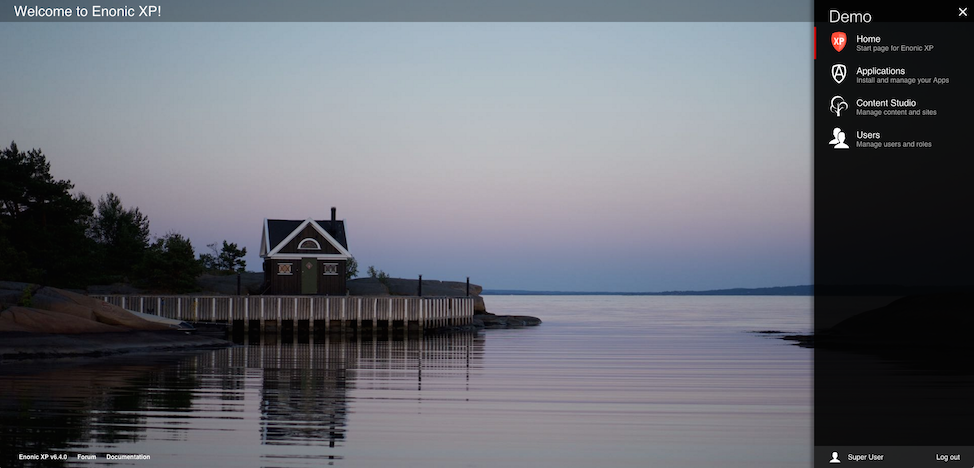

.. _tools:

Tools
=====

.. note:: **Work In Progress**

Tools are independent user interfaces used to administrate your Enonic XP installations.
By default, the following tools are installed and listed in the launcher : "Applications", "Content Studio" and "Users".

Descriptor
----------

The tool **descriptor** is where is defined the information displayed by the launcher and the rights required to access the tool.
If the tool is not to be displayed in the launcher, omit the optional fields "display-name" and "description"

The descriptor file must have the same name as the `tool` folder that contains it ``admin/tools/[tool-name]/[tool-name].xml``:

.. literalinclude:: code/descriptor.xml
   :language: xml

Icon
----

An SVG icon can be associated to the tool to be displayed in the launcher
The icon file must have the same name as the `tool` folder that contains it ``admin/tools/[tool-name]/[tool-name].svg``:

Controller
----------

To drive the tool, we will need a **controller** (See :ref:`http_controllers`). The controller typically produces the initial tool html.
Depending on the tool implementation it may also handle sub-requests from the tool.

The descriptor file must have the same name as the `tool` folder that contains it ``admin/tools/[tool-name]/[tool-name].js``:

.. literalinclude:: code/controller.js
   :language: javascript
