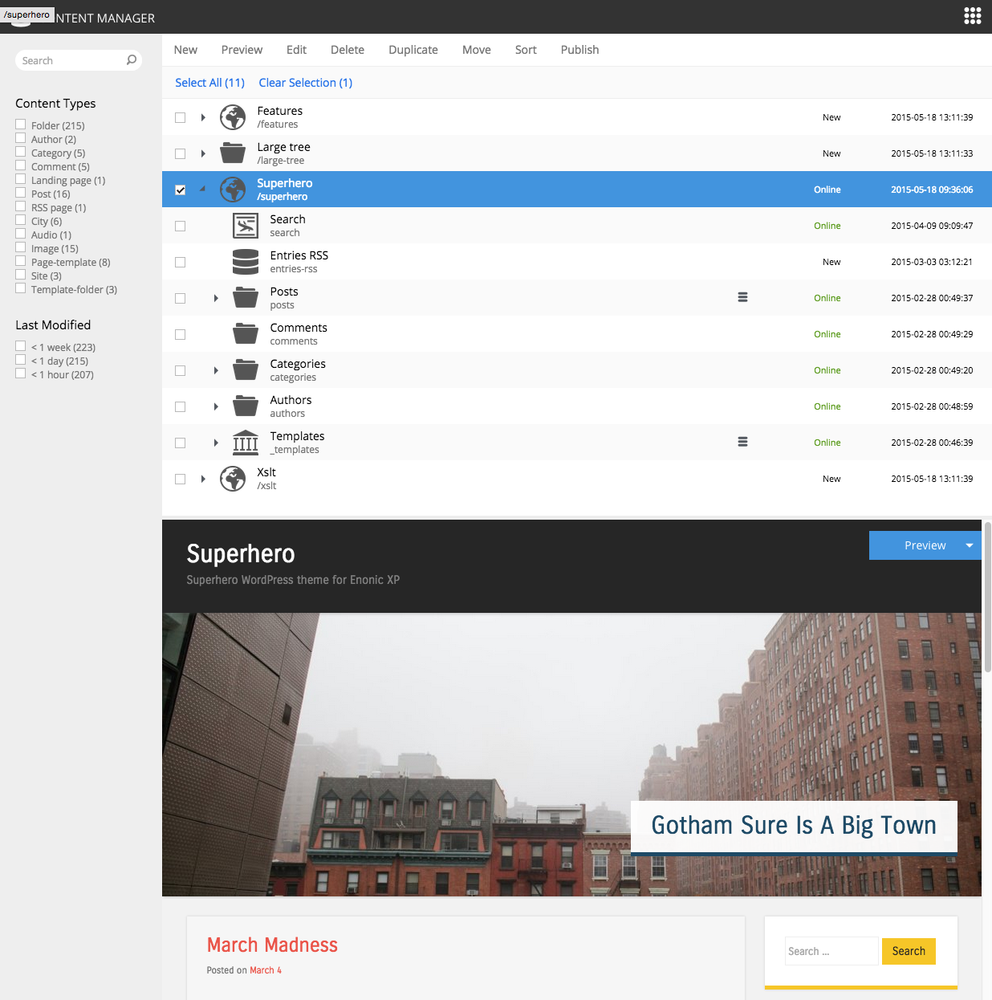

.. _content-content-manager:

Content manager
===============

Enonic XP ships with an application for managing content, called the "Content Manager".

In the above screenshot, we see a listing of content in the middle, a preview of a site-content in the portal and a faceted search on the left side.
