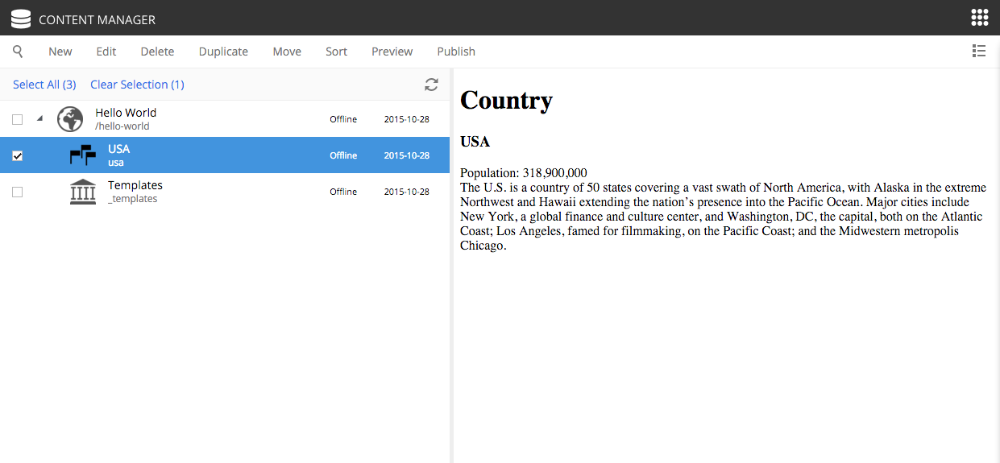

Add your favorite country
=========================

.. |cogicon| image:: images/icon-cog.png

Now that the "Country" content type is installed (and we have a part to display them), we can create
new countries using the :ref:`content-content-manager`.

1. Right-click on the "Hello World" site from the navigation tree and select "New". The "Create Content" dialogue will open.
2. Click "Country" from the list of content types.
3. Fill in the form with the details of your favorite country.

Similar to the site, we must also configure a view for the country

4. In the toolbar, click the cog button |cogicon| to open the Context panel (far right) and the Live Edit panel (blue background).

.. image:: images/country-content-edit.png

5. In the Live Edit panel, select "Hello Region" from the template selector dropdown. If the dropdown arrow is not visible, double-click
   inside the option field or type "h" in it to see the options.
#. In the Context panel, click the "Insert" tab. This reveals a list of built-in components that can be placed into regions.
#. Click and drag a "Part" into the box on the page.
#. A new dropdown option will appear. Select the "country" part. (You can start typing "Country" in the box or you may need to close the
   Context panel to see the dropdown.)
#. Save draft and close the content edit tab.

When you click on the country in the content pane, you should see a preview of the rendered page, something like this:

