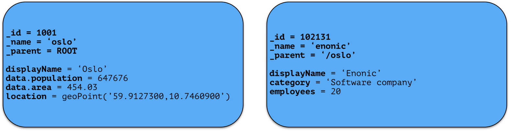

.. _node-domain-nodes:

Nodes
=====

A Node represents a single storable entity of data. It can be compared to a "row" in sql, or a "document" in document oriented storage models.
Nodes are, as mentioned in the previous section, stored in a repository.

Every node has:

* a name
* a parent-reference
* an id
* a timestamp
* a (possibly empty) set of :ref:`node-domain-property` key/value.

Consider two nodes - one node representing the city "Oslo" and another representing the company, "Enonic":

The nodes have different properties. There is no schema to a node, so a node property
value with the same property-name can have different value-types across nodes.
