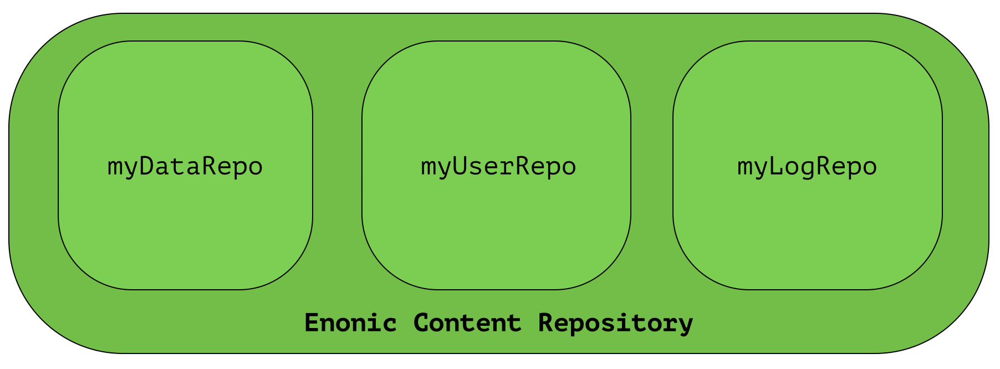

Overview
========

Years of experience has taught us that traditional approaches to data storage (read SQL) are unsuited for the common requirements of modern cloud-based applications and platforms.
A key goal of Enonic XP was to deliver a complete stack - virtually eliminating complex dependencies to 3rd party applications, and minimize requirements to infrastructure.

With the growing popularity of various so-called NoSQL (Not Only SQL) solutions, we evaluated many different technologies and found great inspiration in the following:

Git
  * (+) Cherry picking
  * (+) Branching
  * (+) Pull requests
  * (-) Performance search
  * (-) Granularity of access (all or nothing)

Java Content Repository
  * (+) Hierarchy
  * (+) Granularity
  * (+) Feature set
  * (+) Unstructured
  * (-) Performance
  * (-) Complexity (not document oriented)
  * (-) Attached data model
  * (-) Requires additional storage backend

Elasticsearch
  * (+) Document oriented
  * (+) Scalability
  * (+) Performance
  * (+) Search
  * (+) Aggregations
  * (-) Search engine, not a database
  * (-) No blob support
  * (-) No security
  * (-) Creates schemas

We were unable to find any single solution that was sufficiently simple and included our
desired feature set - so we decided to build our own; the Enonic Content Repository.

The Enonic Content Repository is a place where you can store data,
or more specific, :ref:`node-domain-nodes`.

It is built on top of Elasticsearch and exposes many of it's capabilities in search and aggregations
and scalability - but in addition, provides the following capabilities:

* Hierarchical storage model
* Versioning support
* Complete Access Control and security model
* Blob support - using shared filesystem and append-only approach
* Repository and Branch concepts for content staging
* Schema-less - Add any property you like, at any time
* Rich set of value types (`Binary`, `Reference`)
* SQL-like query syntax

The Enonic Content Repository itself contains one or more separate repositories based on the application need.
For instance, an application could demand a setup having three repositories - one for application data, one for users and one for logging:

