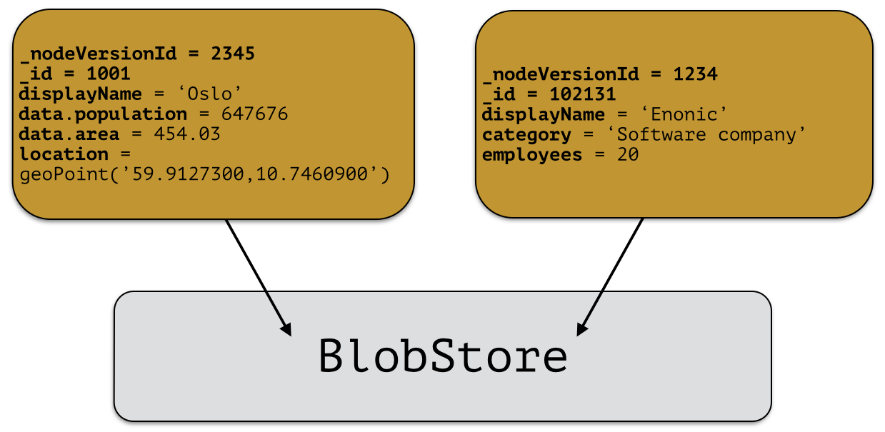
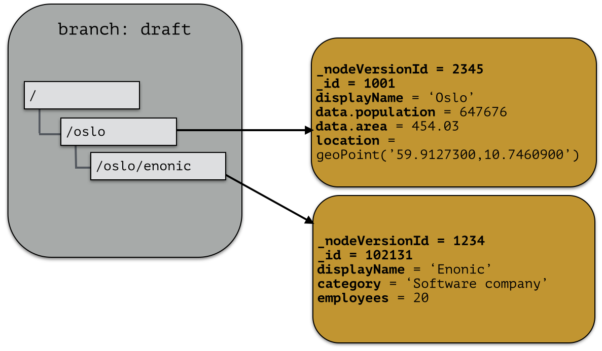
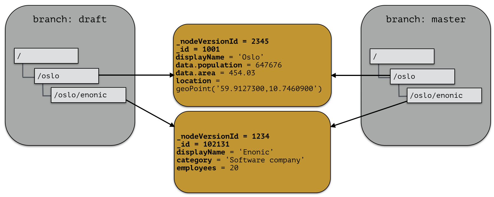
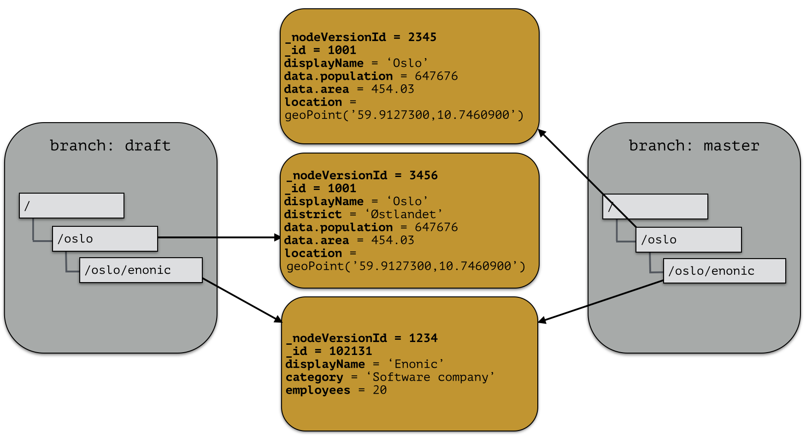
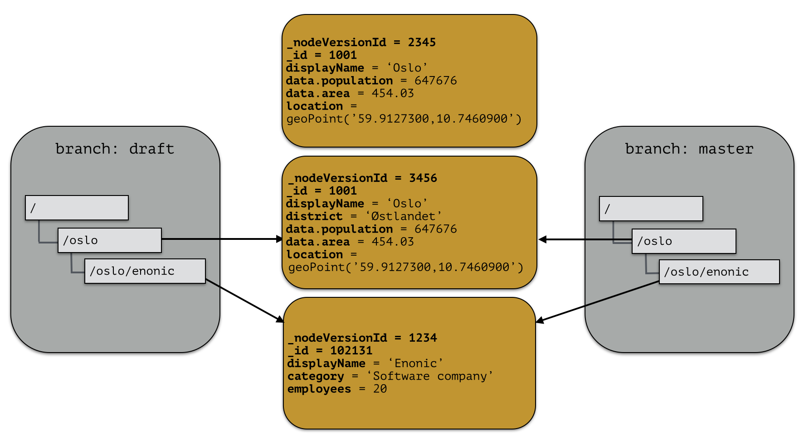

.. _node-domain-repository:

Repository
==========

A repository is a place where nodes can be stored. Data stored in a repository will
typically belong to a common domain. Fetches and searches are by default executed against
a single repository, so it makes sense to keep data from different domains separated in different repositories.
For instance, in the Enonic XP CMS, content and data concerning user management are separated into two
repositories. The Content Studio application uses the ``cms-repo`` repository, and the
User Manager application uses the ``system-repo`` repository.

When nodes are stored in the repository, two things happens:

* The node properties are stored in a :ref:`node-domain-blobstore` as a *node-version*.
  A node-version is an entity representing the properties of the node, without name,
  parent and other meta-data.

* The node is inserted into a *branch*. The branch keeps track of a
  tree-structure referring to node-versions.

A repository will always contain a default branch, called 'master'. If there is
more than one branch, API methods are used for resolving diff between and pushing changes
from one branch to another.

Node versions and branches
--------------------------

Consider the 'Oslo' and 'Enonic' nodes from earlier sections:

.. image:: images/nodes.png

There will be two *node-versions* in the repository stored in the blobstore:

A node-version is a representation of a node's properties. A node-version has no knowledge of name, parent or other meta-data: just the properties of a node.
At the same time, the targeted branch (named 'draft' in this example) gets two entries:

The node-versions are now a part of a tree-structure, based on the node's name and parent.
If we *push* the content of branch 'draft' to the default branch 'master', we end up with something like this:

At the moment, there are two branches pointing to the same node-versions. This means that a single node version can exist in several branches with different structures.
Now, consider that the 'oslo' - node is updated and stored to the 'draft'-branch, resulting in a new node-version with the same id and an updated pointer from the branch:

The two branches now point to different node-versions of the 'oslo' node.
Again, doing a push-operation from 'draft' to 'master' will result in both nodes pointing to the same node-versions:

Repository characteristics
--------------------------

.. NOTE::

  Currently, there is no API for creating and managing repositories, so this
  information is for reference only at the moment.

A repository should be tuned to match the characteristic of the data you want to store, e.g:

* Expected number of documents
* Read or Write - optimized
* Real-time/near real-time/batch - data availability requirements
* Analyzing
* Archiving strategy

For instance; a log repository will have to be able to handle a large amount of data, but there will probably
be no real-time requirements for data to be available. Also, archiving data will be needed to prevent the repository from growing infinitely.
