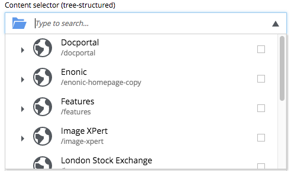
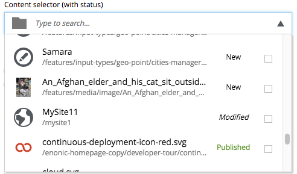
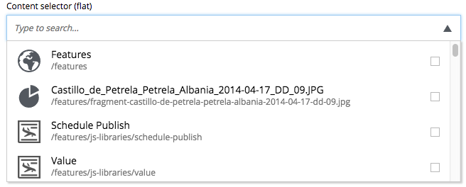

.. _contentselector_type:

ContentSelector
---------------

References to other content are specified by this input type. Use the toggle icon to switch between the list mode (default) and the tree mode.

.. literalinclude:: code/contentselector.xml
   :language: xml

common fields
  All Input Types have these :ref:`Common Fields <input_types_common_fields>`

relationship
  This setting defines the name of which relationship-type to use. Default is system:reference.

allowContentType
  This is used to limit the content types that may be selected for this input using following rules:

  * If you only specify content type name - `citation` - the current app is automatically presumed. Use one setting for each content-type.
  * You can add another app's name - `my.other.app` - followed by a colon (:) and the content type name `:quote` to allow content from other apps, like so: `my.other.app:quote`.
  * Asterisk (*) can be used instead of app name or content type name. For instance `*:quote` will select content type `quote` from any app.
  * *${app}* wildcard is used to denote current app name. So writing `${app}:*` will select all content types from the current app.
  * Regular expressions are also supported. For example `my.other.app:^content*` will select all content types starting with `content` from the app `my.other.app`.
    You can even use complex expressions with negative lookaheads like `((?!folder).)*$` that will return all content types except the ones containing `folder`.

allowPath
  This is used to limit the path of the content that may be selected for this input. The site on which the content exists, can be wildcarded with ${site} Use one setting for each path expression.

.. literalinclude:: code/allowpath-samples.xml
    :language: xml

treeMode
  By default content selector is displaying content in the list mode but you can switch it to default tree-mode (same as in the Content grid) by setting `treeMode` to `true`.

showStatus
  You can display current status for each content item inside the content selector by setting `showStatus` to `true`.

hideToggleIcon
  The toggle mode icon can be hidden by setting `hideToggleIcon` to `true`.

