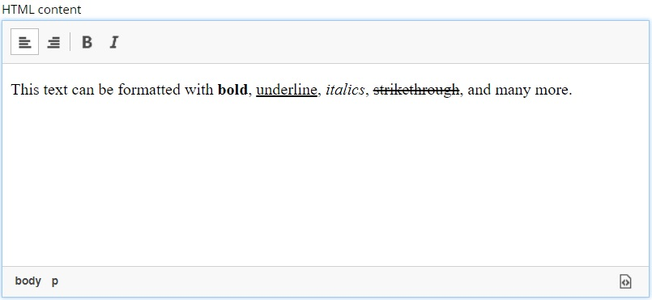

.. _htmlarea_type:

HtmlArea
--------

A field for inputting multi-line text, with formatting options.

.. literalinclude:: code/htmlarea.xml
   :language: xml

common fields
  All Input Types have these :ref:`Common Fields <input_types_common_fields>`

default
  This element specifies a default value. The value can contain any HTML elements, but tags must be correctly closed since the input type is defined inside an XML.

config
   forced-root-block
      This config setting can be used to override default wrapper element in the root of the HTML Area. By default it's ``
`` element. Set this option to "div" to switch to ``
``.
   include
      List of space-separated tools to be added to the toolbar (see the tip below).
   exclude
      Use this to hide some of the default tools in the toolbar (see the tip below).

.. tip:: HTML Area is configured with default set of tools but the toolbar can be customized.
   Using the config setting you can exclude specific tools from being shown (use "*" to exclude all tools at once) and/or include those that you want to have in the toolbar.
   Separate tools with a space and use "|" character to group tool buttons together.
   Complete list of supported tools can be found in description of :ref:`editing_input_types_html`.

.. literalinclude:: code/htmlarea-customized.xml
   :language: xml

Default configuration of the HTML Area toolbar is shown below:

::

   Format Bold Italic Underline Strike Subscript Superscript Code Blockquote | JustifyLeft JustifyCenter JustifyRight JustifyBlock | BulletedList NumberedList Outdent Indent | SpecialChar Anchor Image Macro Link Unlink | Table | PasteText Maximize

=============    ==================================
Name             Description
=============    ==================================
Format           Text format menu
Bold             Bold text
Italic           Italic text
Underline        Underline text
Strike           Strikethrough over text
Subscript        Subscript text
Superscript      Superscript text
Code             Wrap text with code tag
Blockquote       Quotation
JustifyLeft      Left align content
JustifyCenter    Center content
JustifyRight     Right align content
JustifyBlock     Justify content
BulletedList     Add a bullet list
NumberedList     Insert a numbered list
Outdent          Decrease indent
Indent           Increase indent
SpecialChar      Insert a special character
Anchor           Insert an anchor
Image            Insert/Edit an image
Macro            Insert a macro
Link             Insert/Edit a link
Unlink           Remove link
Table            Table format menu
PasteText        Toggle paste text mode
Maximize         Full screen mode
=============    ==================================

These are additional tools supported by HTML Area that can be used in the input config:

==============   =====================================
Name             Description
==============   =====================================
NewPage          Clean editor's content
Preview          Preview HTML Area contents
Print            Print editor's content
Templates        Template to open in the editor
Copy             Copy selected text into buffer
Cut              Cut selected text into buffer
Paste            Paste text from buffer
PasteFromWord    Paste text from Word
Undo             Undo last action
Redo             Repeat last action
SelectAll        Select editor's content
Scayt            Spell checker
Form             Insert form
Checkbox         Insert checkbox
Radio            Insert radiobutton
TextField        Insert text input
Textarea         Insert textarea
Select           Insert select tag
Button           Insert button
HiddenField      Insert hidden field
CopyFormatting   Copy formatting
RemoveFormat     Remove formatting
CreateDiv        Wrap with div
BidiLtr          Text direction left to right
BidiRtl          Text direction right to left
Language         Add lang attribute
Flash            Insert flash
HorizontalRule   Insert a horizontal line
Styles           Text styles menu
Font             Font menu
FontSize         Font size menu
TextColor        Text color
BGColor          Background color
ShowBlocks       Visualize all block-level elements
==============   =====================================
