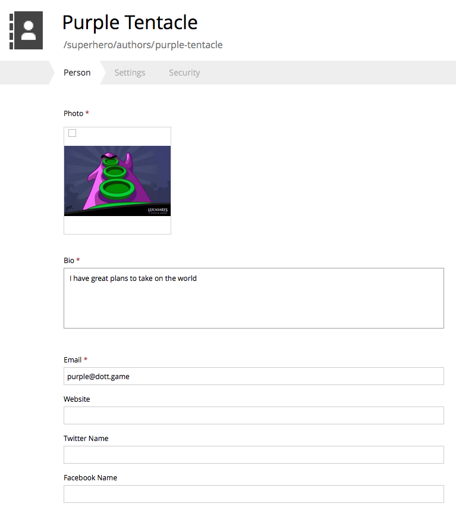

Sample Content type
===================

A "Person" content type might look something like this:

The underlying schema configuration would look like this

.. literalinclude:: code/person.xml
   :language: xml

And the persisted (and searchable node) would look like this:
NB! The content type defined properties are stored within the 'data' propertySet.

.. literalinclude:: code/person.json
   :language: javascript
