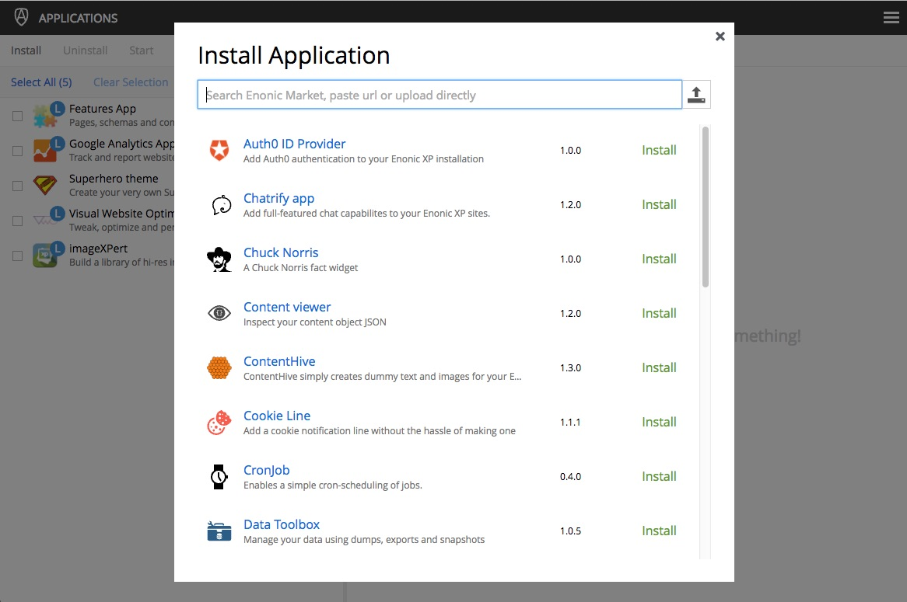
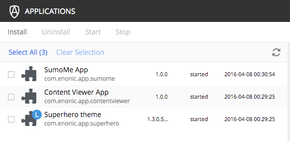

.. _application_tool:

Applications
============

The Applications admin tool provides an interface to install, uninstall, start and stop applications for an Enonic XP installation. A list
of the installed applications appears in the left panel. Applications in this list can be selected by clicking on them. Information about
a selected app appears in the right panel. This information includes the basics such as version, key and system requirements as well as a
list of schemas for content types, mixins and relationship types, and also a list of descriptors, which are components for pages, parts and
layouts.

.. image:: images/apps-tool.jpg

Installing an app
-----------------

Two methods of installing apps are available with the Applications tool. Both are initiated by clicking the "Install" button in the toolbar
which will open a modal dialog.

Install from Enonic Market
``````````````````````````

Applications from the Enonic Market are listed in the dialog in alphabetical order. Each app in the list has a name, a brief description, version
number and an "Install" link that will download, install and start the app. Installation will occur on all nodes of a clustered environment.
Clicking the name of an app will open a page on the Enonic Market website with more information about the app. If application is already installed
but there's a newer version of the app on the Market, the download link will say "Update" instead of "Install". You can use the search field
above the application list to quickly filter the list.



Install via file upload
```````````````````````

An application can also be installed by dragging an application JAR file directly onto the installation dialog. Alternatively, you can click
the upload button to the right of the search field and select an application JAR file from your local filesystem. The app will be installed
and started automatically when the download is complete.

.. image:: images/install-upload.jpg

Manual installation
```````````````````
A third method of installing apps involves placing the application JAR file into the ``$XP_HOME/deploy`` folder. It is not possible to do
this with the Applications admin tool. Apps installed this way would require the JAR file to be placed in the ``$XP_HOME/deploy`` folder on
each node in a cluster. Locally installed apps will have a blue circle with an "L" on the app icon in the list of installed apps. The
Superhero theme app was installed locally in the image below. Locally installed apps can only be uninstalled by deleting the JAR file in the
``$XP_HOME/deploy`` folder.

