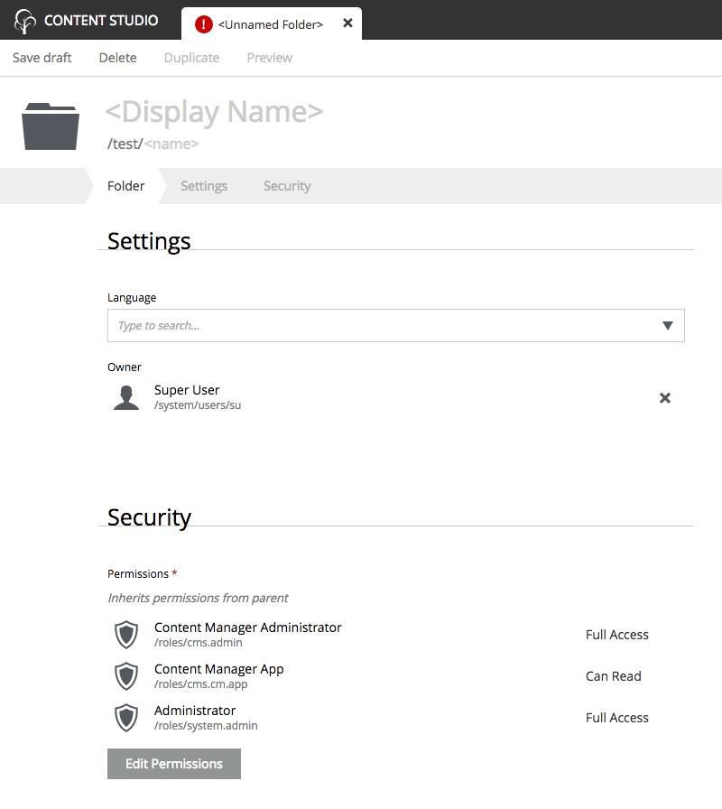

.. _folder:

Folder
======

Content of type **Folder** is only used to group other contents. Folders have no data fields other than the display name and path name.
They also have the **Settings** and **Security** sections like any other content.

