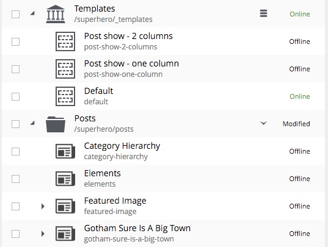

.. _sorting_content:

Sorting content
===============

Child items of any content can be sorted in a number of ways through the **Sort items** dialogue. It is accessed with the **Sort** button in
the toolbar or context menu, or by clicking a "sort" icon that appears for previously sorted content.

.. image:: images/sort.jpg

The default sorting is by the **modified** time in descending order. The other options are **modified** time ascending, **DisplayName**
(ascending or descending), and **Manually Sorted**. To manually sort items, simply drag and drop them in the **Sort items** dialogue.

.. image:: images/sort-options.jpg

Once items are sorted, the parent content will have an arrow in the browse view tree grid pointed up or down to denote ascending or descending. If the
content is manually sorted, an icon with three horizontal bars will appear. Clicking the bars or arrow icon will open the **Sort items**
dialogue. In the image below, the Templates folder has manual sorting and the Posts folder is sorted by DisplayName descending.

.. :NOTE:: The order of sorted content might only be visible in the Content Studio. A list of content on a website will only follow the
   sorting rules if the application code retrieves the content with the content.getChildren function.