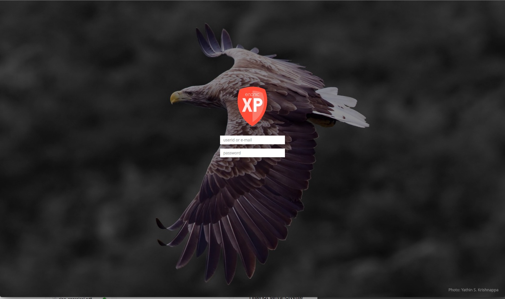

Editor Guide
===========

.. NOTE::
   This section is under construction. This information is likely incomplete and possibly inaccurate until this notice is removed.

When visiting the Enonic XP admin interface - you will be required to log in.
Unless otherwise configured, the standard login screen will be displayed. If this is a test-installation, you can login with "su" and "password".

.. toctree::
   :maxdepth: 1

   home
   contentstudio/index
   applications/index
   users/index
