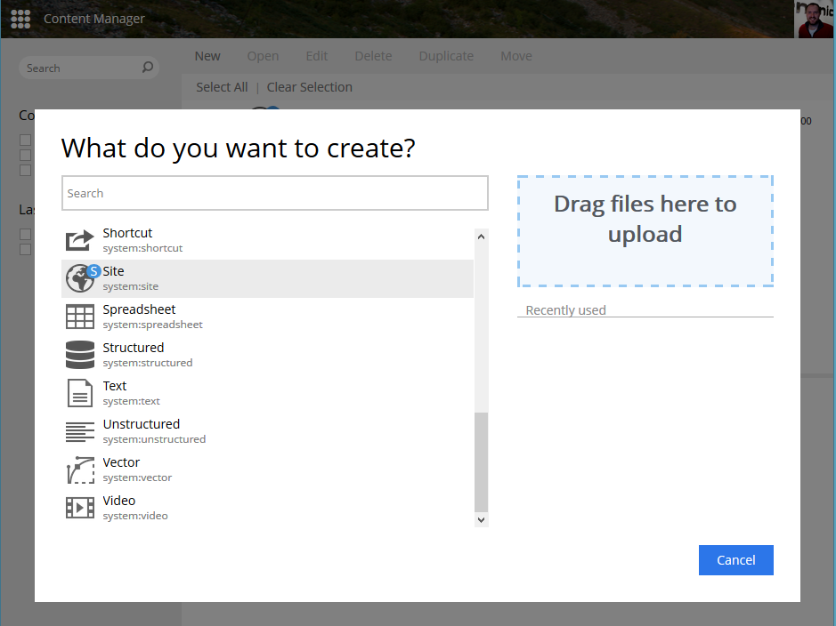
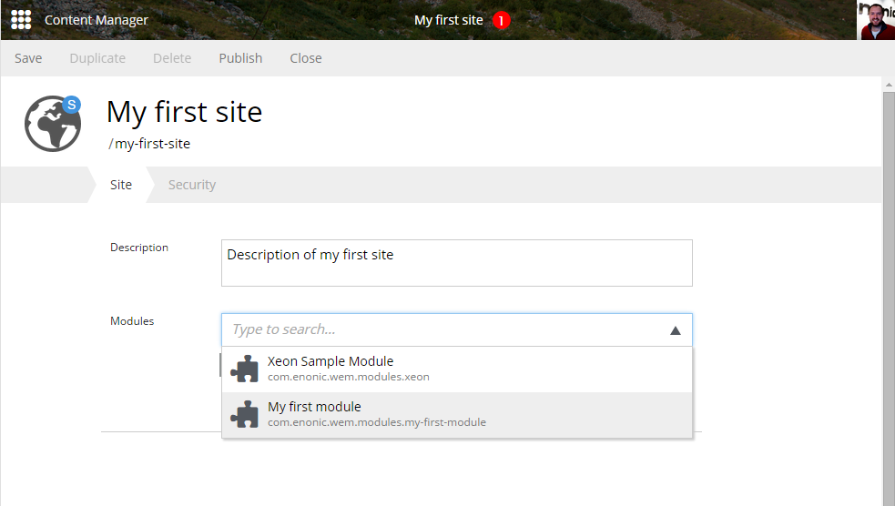

Setting up a site
=================

First, log into the admin console and open the Content Manager app.
Then click the ``New`` button and scroll down to find and select ``site`` from
the list. The default username and password is ``su`` and ``password``.

Fill in a site name and description and select the modules you want to add to
the site. Finally, save the site.

