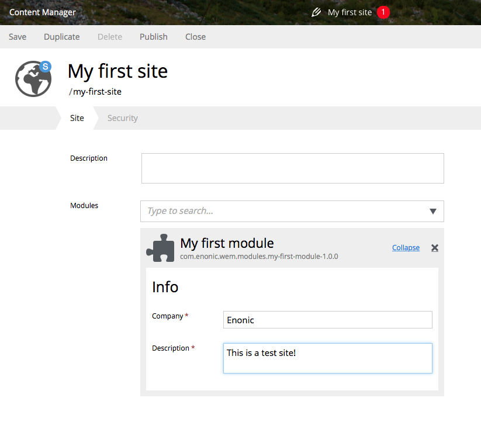

Configuring the module
======================

Global configuration variables for the site may be defined in the config element of ``site.xml``. Values for these
settings can be filled in when you edit the site in the admin console.

.. literalinclude:: code/site.xml
   :language: xml

The company and description fields may now be filled out by editing the site. The values will be used in a standard
footer for each page.

To use the module configuration values, the controller must retrieve the config element for the module and pass it
to the Thymeleaf rendering method.

.. literalinclude:: code/controller.js
   :language: javascript

Now we can update ``my-first-page.html`` file to render the configuration values that were passed from
the controller.

.. literalinclude:: code/thymeleaf.html
   :language: html
