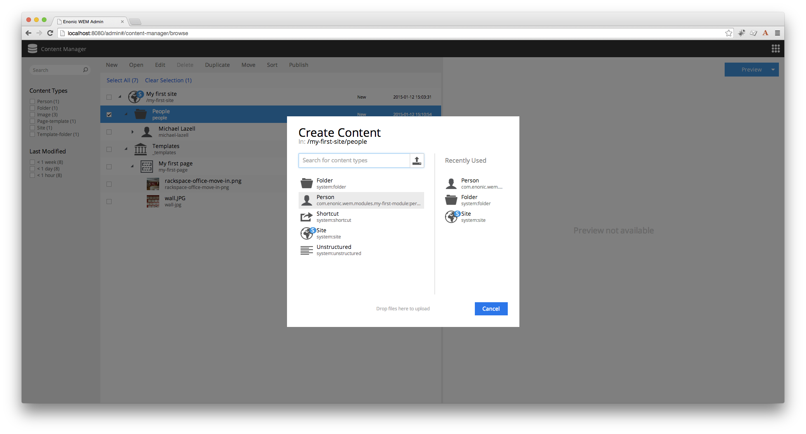
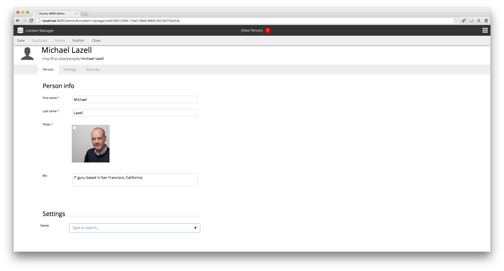

Adding content
==============

Once you rebuild the module, go to the content manager and select ``New``. You will see ``Person`` listed as an available
content-type in the administration console.

When you create a new ``Person`` content then you will see the form that was generated by the XML.

