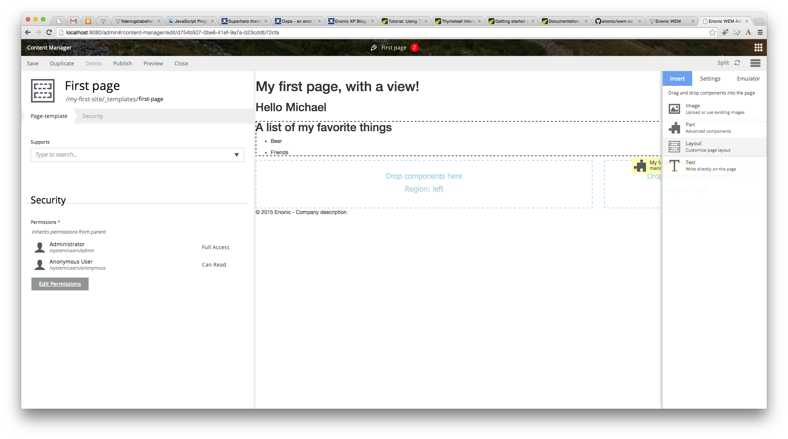

Creating a layout
=================

Layouts are used in conjunction with ``regions`` to organize the various component parts that will be placed on the page
via live edit drag and drop. Layouts can be dropped into the page ``regions`` and then ``parts`` can be dragged into the
layout. This allows multiple layouts (two-column, three-column, etc.) on the same page and web editors can change things
around without touching any code. Layouts can even be nested. Making a layout is similar to making pages and part
components. They require a descriptor, a controller, and a view. We will make a two column layout with the widths at 70%
and 30%.

The layout descriptor defines regions within the layout where parts can be placed with live edit. First make a new folder
``layouts/layout-70-30``. Within this folder, make a file called ``layout-70-30.xml`` as seen below.

.. literalinclude:: code/layout.xml
   :language: xml

Also, create a file called ``layout-70-30.js`` in the ``layout-70-30`` folder.

.. literalinclude:: code/controller.js
   :language: javascript

To make the layout view, create a file in the ``layout-70-30`` folder called ``layout-70-30.html``.

.. literalinclude:: code/thymeleaf.html
   :language: html

Some CSS must be added to style the page for the layout columns to work. Create a css folder inside the ``assets`` folder.
Boostrap is used in this example so go ahead and `download the minified CSS file`_ and put it
in the ``assets/css`` folder. Now the head element of the ``view/my-first-page.html`` file must be updated so that it
includes the bootstrap CSS file.

.. _download the minified CSS file: http://getbootstrap.com/getting-started/

.. literalinclude:: code/head.html
   :language: html

After rebuilding the module, edit the page and click the ``Insert`` tab on the right. Then drag and drop a ``Layout`` to the
``main`` region. Then select the ``70/30`` layout from the dropdown. Now you can drag an image, text, or part into the layout
regions.

