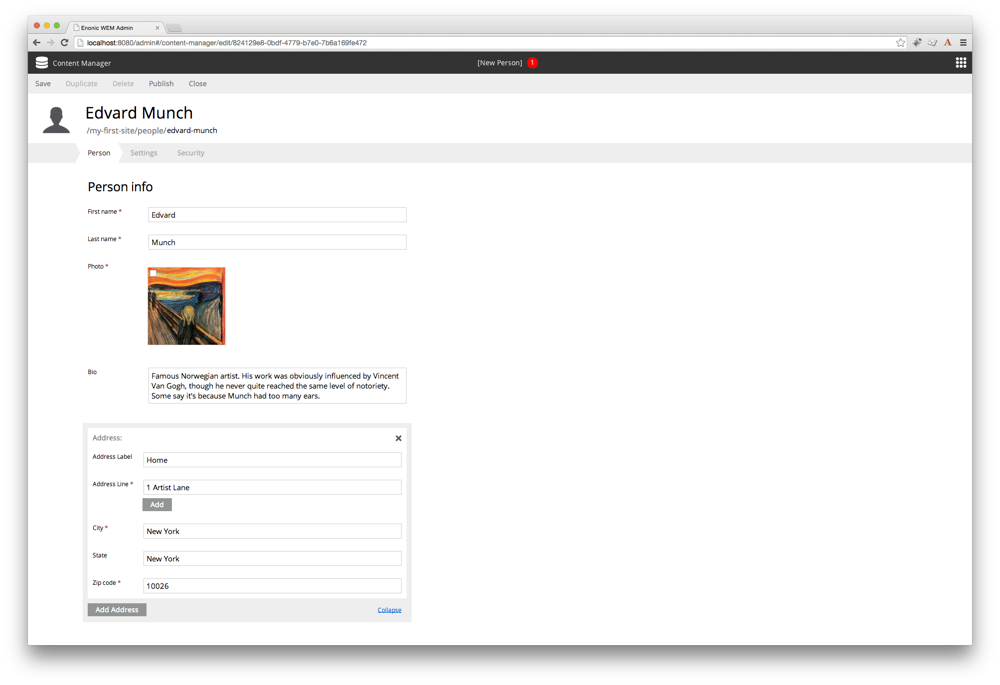

Using a Mixin
=============

Now it is time to use the mixin in a content type. Below is the previous ``Person`` content type, modified to include
an address. The mixin line as at the bottom.

.. literalinclude:: code/content-type.xml
   :language: xml

Now you can edit a ``Person`` content and see the new address fields.

