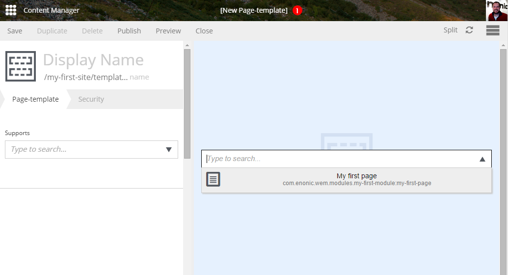
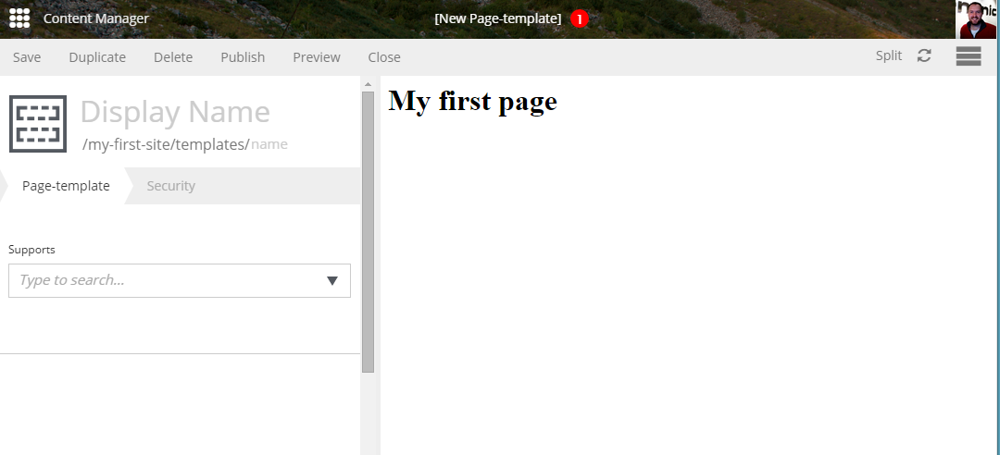

Adding a Controller
===================

To be able to give a response to a request to this page, we will need to create
a controller in the ``page/my-first-page`` folder. The controller is
written in JavaScript and must be named ``controller.js``. A controller
exports a set of methods, one for each HTTP method that should be handled.
The handle method has a request object as parameter and returns the result.

.. literalinclude:: code/controller-1.js
   :language: javascript

Create a simple ``controller.js`` file to render an HTML-page when it
receives a get request.

.. literalinclude:: code/controller-2.js
   :language: javascript

To view this page in Enonic XP, the project must first be built and then
deployed. Then open the Content Manager app and find the site
(that you created earlier). Click to expand the site and find the
``Templates`` folder. Click this folder and select ``New`` to create
an new ``Page template``. Select the ``My-first-page`` from the dropdown on
the right as seen below.

The result should look something like this. Give it a name and save.

