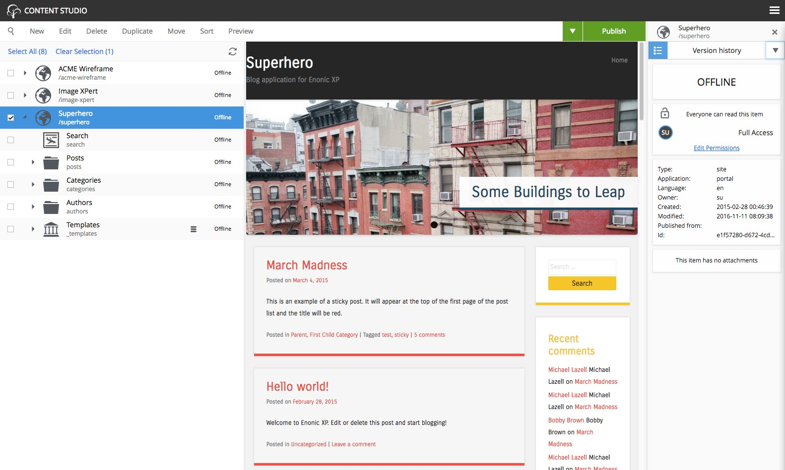
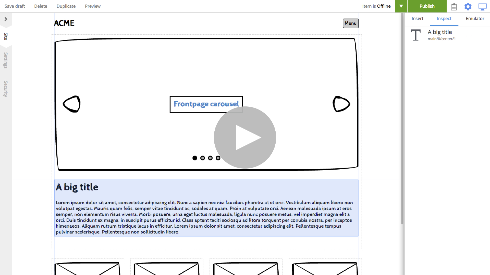

The sample applications automatically create demo sites you can try out.

* Select "Content Studio" from the launcher menu
* Once loaded, you will find the sites in the tree grid
* Select or expand the sites you are interested in for a preview
* Right click or choose actions from the menu to get going

**Wireframe Prototyping Application**

Watch this video to see how you can make interactive prototypes with Enonic XP and learn about Content Studio:

**Superhero Blog Application**

Watch this video to learn how you can use Enonic XP as a blogging platform, and learn more about Content Studio:

