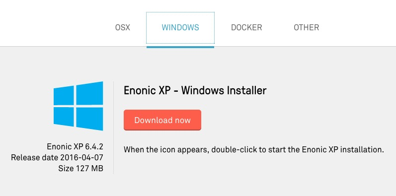

.. _install_windows:

Windows installer
=================

This section describes how to install Enonic XP on a Windows computer.

.. note:: The Java JDK is not required to run XP with this installer, but developers will need the JDK to build applications for Enonic XP.

.. note:: **General Requirements**

   * At least 1 GB of available memory
   * HTTP port 8080 should be available (this can be changed if needed, see :ref:`configuration`)

Download
--------

Visit the Enonic XP `download page <https://enonic.com/downloads>`_ and select the **WINDOWS** tab. Click the **Download now** button and
save the .exe file to a convenient location.

Open the file when it is finished downloading and follow the instructions to install Enonic XP.

Enonic XP will start and a
window will open with the log. XP will continue to run while this window is open. The **Home Directory** button will open Explorer to the XP
home folder where the installation's files can be found. The **Launch Browser** button will open the Enonic XP administration interface in
the default browser. The admin UI can also be reached at http://localhost:8080

.. .. image:: images/mac-startup.jpg

Log In
------

* Click the **Launch Browser** button or point your browser to ``http://localhost:8080``
* Log in with username ``su`` and password ``password``.

After logging in you should see the following screen, with the launcher panel to the right:

.. image:: images/admin.jpg

Install Superhero Blog
----------------------

.. include:: install.rst

.. include:: start-blogging.rst

Next Steps
----------

.. include:: next.rst