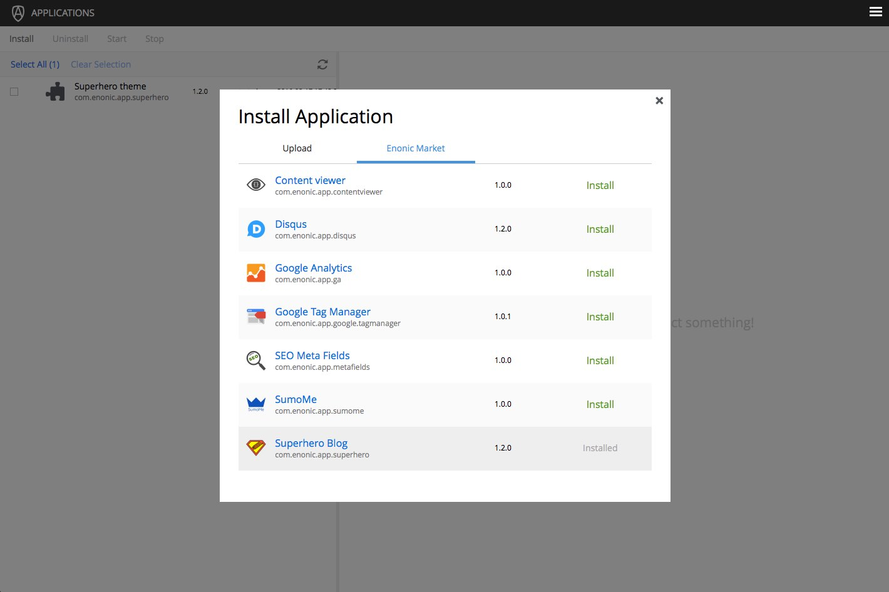

This is a simple blog, basically emulating Wordpress - even using one of their nice themes. Follow these steps to try it out:

**Install from Market**

* Open the `Applications` tool from the launcher panel to the right
* Click `Install` from the menu (top left)
* Select `Enonic Market` from the dialogue
* Browse to the application named "Superhero Blog" and click `Install`

