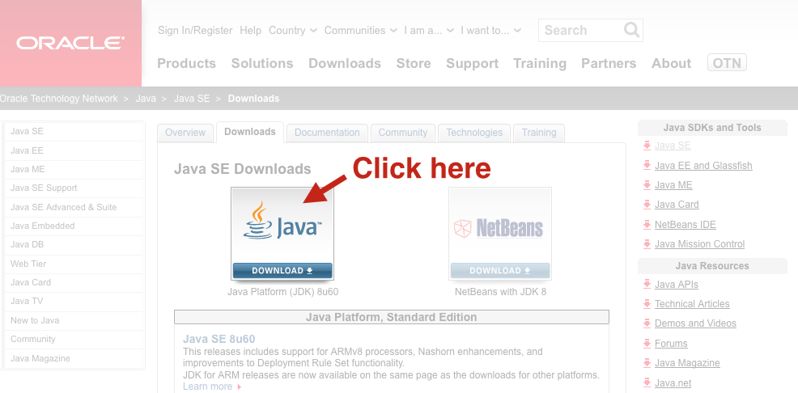

.. _local_installation:

Install on my Computer
======================

This section describes how to install Enonic XP on your own computer. If you have any problems,
please look at our :ref:`troubleshooting` section.

.. note:: **General Requirements**

   * Any OS supporting Java (Mac, Linux, Windows etc)
   * Java JDK 1.8 (update 40 or newer)
   * At least 1 GB of available memory
   * HTTP port 8080 should be available (this can be changed if needed, see :ref:`configuration`)

Install Java
------------

.. warning:: To run Enonic XP, you need Java Development Kit (JDK) 1.8.40 JDK or newer.

**Check JDK Version**

If you're not sure what JDK version you have (or even if you have one), run the following in your terminal/shell:

::

  javac -version

This should produce a response such as: "javac 1.8.0_60"

Having problems with your existing Java installation? Check out our :ref:`troubleshooting_java` documentation.

**Optionally Install Java**

If it turns out you're on the wrong java version, follow these steps

* Download it from http://www.oracle.com/technetwork/java/javase/downloads/index.html

* Follow the instructions for your respective operating system

Download Enonic XP
------------------

Enonic XP is available in a simple universal distribution file - running on all plaforms (Windows, Linux, OSX etc)

* `Download Enonic XP distribution <https://enonic.com/try-now#download-now>`_
* Unzip the file to a suitable location

.. hint::

  **Commandline Ninja version** ::

    curl -O http://repo.enonic.com/public/com/enonic/xp/distro/6.1.0/distro-6.1.0.zip
    unzip distro-6.1.0.zip
    cd enonic-xp-6.1.0

Next - let's get the server started

Start the server
----------------

Now that the software has been downloaded, you're ready to start the
server - start the respective file from command line.

Linux and OS X::

  [XP Installation Folder]/bin/server.sh

Windows::

  [XP Installation Folder]\bin\server.bat

This will start Enonic XP. When successfully started, the following will appear at the end of the log::

  12:53:14.302 INFO  c.e.x.l.framework.FrameworkService - Started Enonic XP in 7378 ms

Log In
------

* Point your browser to ``http://localhost:8080``

.. include:: login.rst

Install Superhero Blog
----------------------

This is a simple blog, basically emulating Wordpress - even using one of their nice themes. Follow these steps to try it out:

**Deploy App**

* `Download the Superhero Blog Application <https://repo.enonic.com/public/com/enonic/app/superhero/1.0.0/superhero-1.0.0.jar>`_
* Copy the application file into [XP Installation Folder]/home/deploy/

.. include:: start-blogging.rst

Next Steps
----------

.. include:: next.rst
