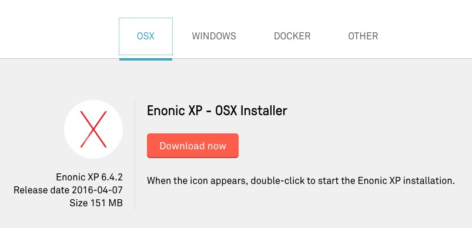
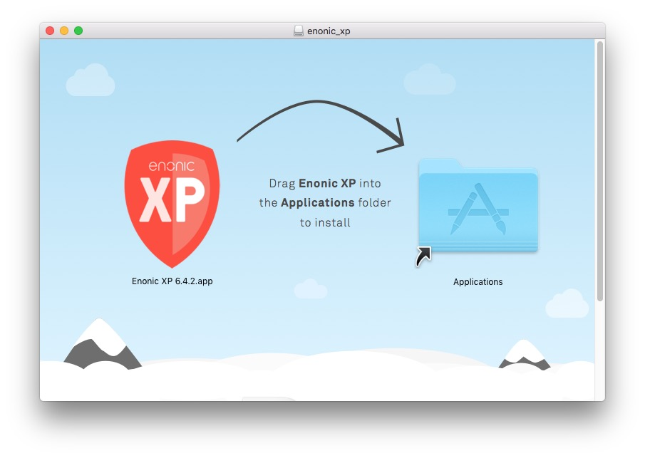
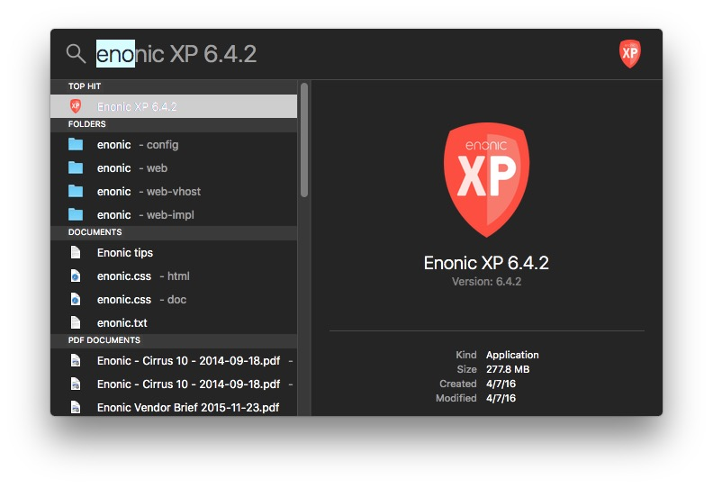
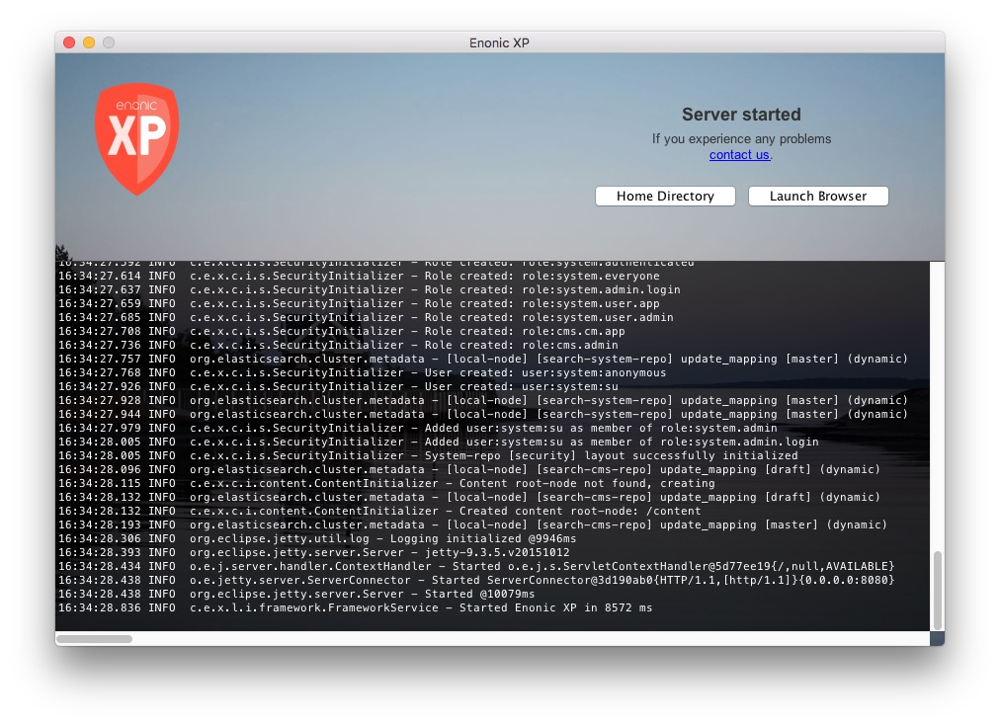
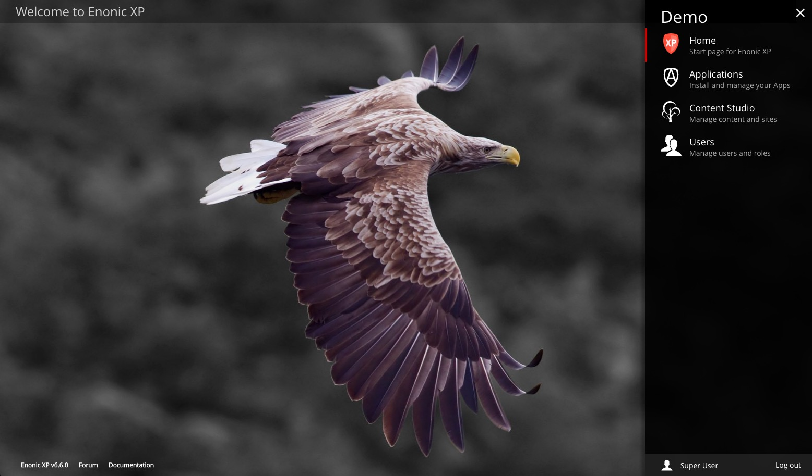

.. _install_mac:

OSX
===

This section describes the easiest way to install Enonic XP on a Mac OSX computer.

.. tip:: The Java JDK is not required to run XP with this installer, but developers will need the JDK to build applications for Enonic XP.

.. note:: **General Requirements**

   * Mac OSX
   * At least 1 GB of available memory
   * HTTP port 8080 should be available (this can be changed if needed, see :ref:`configuration`)

Download
--------

Visit the Enonic XP `download page <https://enonic.com/downloads>`_ and select the **OSX** tab. Click the **Download now** button and save
the .dmg file to a convenient location.

Open the file when it is finished downloading. A window like the one in the image below will appears. Click and drag the Enonic XP logo to
the Applications folder.

Find the Enonic XP app in the applications folder, or use Spotlight search, and double click to open it.

A notice may appear to inform you that the file was downloaded from the Internet. Go ahead and click "Open". Enonic XP will start and a
window will open with the log. XP will continue to run while this window is open. The **Home Directory** button will open Finder to the XP
home folder where the installation's files can be found. The **Launch Browser** button will open the Enonic XP administration interface in
the default browser. The admin UI can also be reached at http://localhost:8080

Log In
------

* Click the **Launch Browser** button or point your browser to ``http://localhost:8080``
* Log in with username ``su`` and password ``password``.

After logging in you should see the following screen, with the launcher panel to the right:

Install Superhero Blog
----------------------

.. include:: install-app.rst

.. include:: start-blogging.rst

Next Steps
----------

.. include:: next.rst
