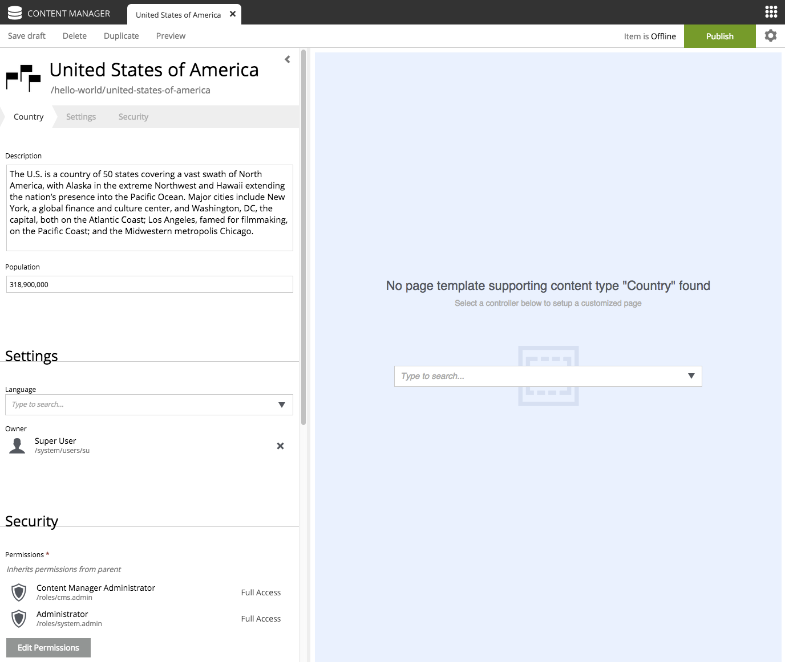

Add Favorite Country
--------------------

Now that the "Country" content type is installed (and we have a part to display them), we can create
new countries using the :ref:`content-content-manager`.

#. Select the "Hello World" site from the navigation tree
#. Choose "New" and select "Country" from the list of content types.
#. Fill in the form with the details of your favorite country and click "Save draft".

Similar to the site, we must also configure a view for the country

#. From the Live Edit panel to the right, select "Hello Region" (this "pretty" name comes from the XML page descriptor file).
#. Open the context panel (activated from the configuration cog button in the toolbar).
#. Under the "Insert" tab, drag and drop a "Part" into the box on the page.
#. A new dropdown option will appear. Select the "country" part. (You can start typing "Country" in the box or you may need to close the
   context panel to see the dropdown.)
#. Save draft and close the content edit tab.

When you click on the country in the content pane, you should see a preview of the rendered page, something like this:

.. image:: images/country-content-rendered.png
