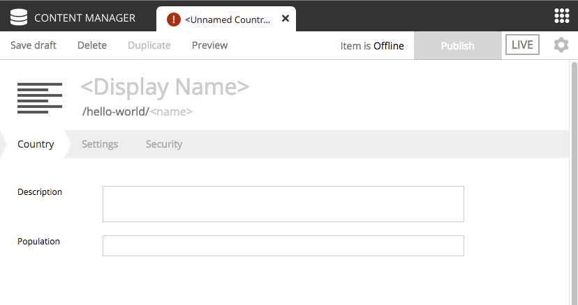

Adding Countries
================

In order to make our "World" slightly more interesting, we need some data
- or more specifically countries.

Country Content Type
--------------------

To add structured data (such as countries), we need so-called :ref:`content-domain-content-types`.
The content type defines the form (and underlying schema) of items you manage.

1. Create a folder called "country" inside the "content-types" folder of your project.

2. Add the Country content type file below to this folder:

.. literalinclude:: code/content-types/country1.xml
  :language: xml
  :caption: Country content type - site/content-types/country/country.xml

Each content type can have a custom icon that will be visible in the Content Manager app. Though not required, content icons can be helpful
for content editors.

3. Copy the image below to the the same folder (content-types/country) with the name `country.png`.

.. image:: images/country.png

This content type defines form inputs for **description** and **population**. All content has a built-in field for **Display Name**. When
the app is redeployed, this content type will produce the form seen below in the Content Manager app.

.. tip:: Each content type must reside in its own folder under the ``site/content-types`` directory. The name of the content type XML file
   and the icon PNG file must be the same as the directory that contains them.
