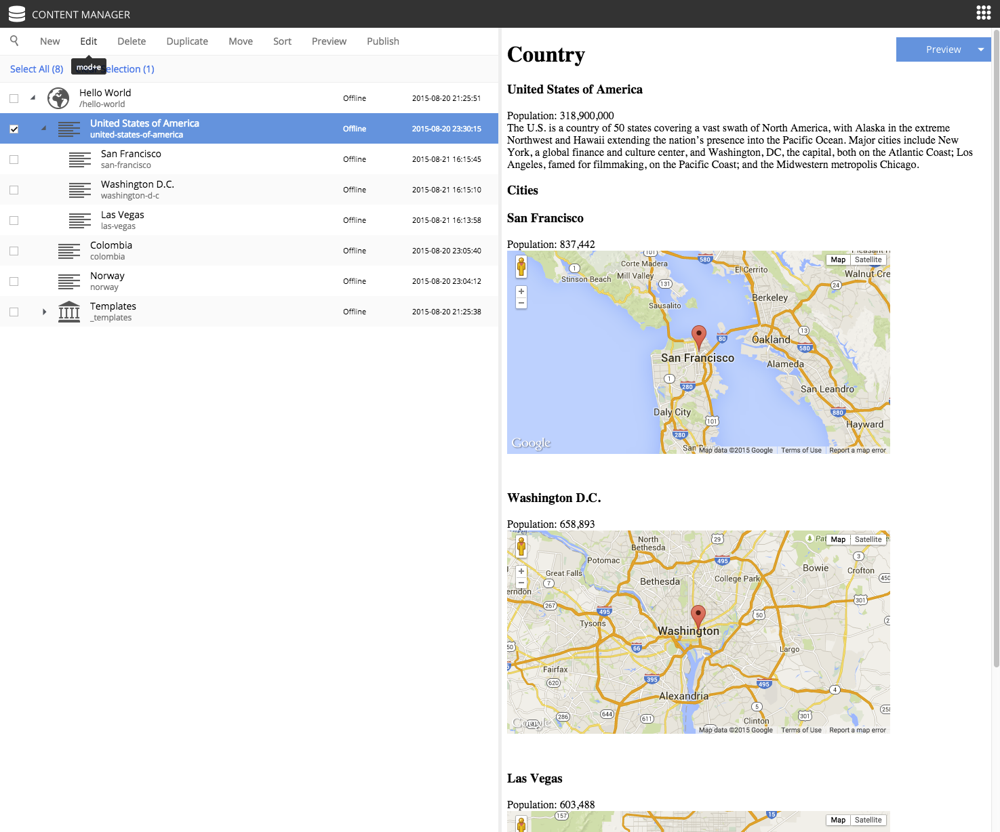

Create Cities
-------------
.. |cogicon| image:: images/icon-cog.png

Now let's make use of the new city content type and part component. First we need to add the "City list" part to the "Country" page
template.

#. Edit the "Country" page template.
#. Open the context panel by clicking the cog button |cogicon| in the toolbar.
#. Click and drag a `Part` to the page region below the "country" part. (This may be a bit tricky because the "country" part is small.)
#. Select the "City list" part from the dropdown in the box. You may need to close the context panel to see it.
#. Save and close the tab.

Now we need to create a few City contents below a selected country. (Sample data is available in the table below.)

#. From the content pane, select a country content that you created earlier. It is important that the city content be created under the country.
#. Right-click on the country content and select "New". The "Create content" dialogue will open.
#. Now select "City" from the list of content types.
#. Fill in the city name and location; the population is optional. The location format must be comma separated latitude and longitude
   with decimals. Do not select a page template from the dropdown on the right.
#. Save draft.
#. Create several more city contents below each country content by repeating the previous steps. Sample data is provided in the table below.

+--------------------+----------------+------------------+-----------+
|Country             |City            |Lat,Long          |Population |
+====================+================+==================+===========+
|USA                 |San Francisco   |37.7833,-122.4167 |837,442    |
+                    +----------------+------------------+-----------+
|                    |Las Vegas       |36.1215,-115.1739 |603,488    |
+                    +----------------+------------------+-----------+
|                    |Washington D.C. |38.9047,-77.0164  |658,893    |
+--------------------+----------------+------------------+-----------+
|Norway              |Oslo            |59.9500,10.7500   |618,683    |
+                    +----------------+------------------+-----------+
|                    |Bergen          |60.3894,5.3300    |265,857    |
+                    +----------------+------------------+-----------+
|                    |Trondheim       |63.4297,10.3933   |178,021    |
+--------------------+----------------+------------------+-----------+
|Colombia            |Bogota          |4.5981,-74.0758   |7,000,000  |
+                    +----------------+------------------+-----------+
|                    |Medellin        |6.2308,-75.5906   |2,440,000  |
+                    +----------------+------------------+-----------+
|                    |Barranquilla    |10.9639,-74.7964  |1,885,500  |
+--------------------+----------------+------------------+-----------+

Each country page will now have a list of the cities you created with a Google map of the location.
It should look something like this:

Configure part
--------------

The `City list` part descriptor (site/parts/city-list/city-list.xml) has configuration inputs for the map type and zoom level. You can set
the default values for these inputs by editing the `City list` part in the `Country` page template.

#. Open the `Country` page template for editing.
#. Open the context panel by clicking the cog button |cogicon| in the toolbar.
#. Click on the `City list` part in the Live Edit panel. (The `Inspect` tab should open.)
#. Set the Map type to "Hybrid" and Zoom level to 12 with the form inputs in the context panel.
#. Save draft and close the edit tab.

Now all of the countries will show the city maps with the new settings. You can override these defaults for any individual country by
editing the Country content and changing its `City list` part configuration.

.. image:: images/city-list-config.png
