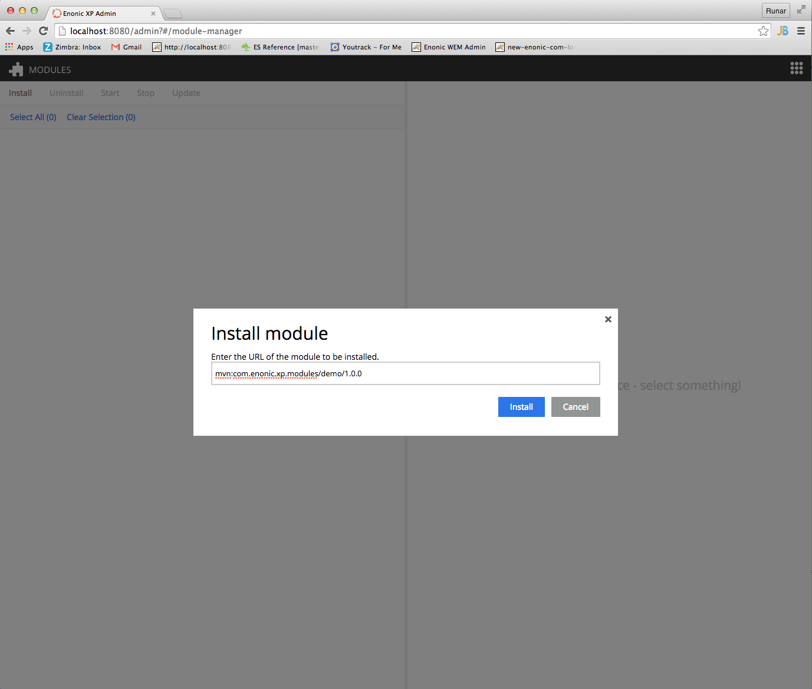
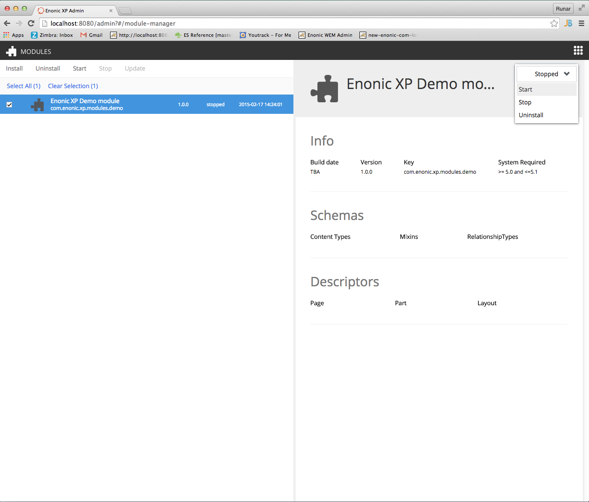

Install Demo Module
===================

This section will guide you through the installation of the demo module.

Install via Admin Console
-------------------------

Sign into the admin console, and launch the 'Modules' App. You will need a
user with the "Administrator" role (system.admin) to do this.

Click ``Install`` in the toolbar, and enter the URI below::

  mvn:com.enonic.xp.modules/demo/1.1.0

Once the module is installed, it will appear in the list of modules.
Select the module and start it from the menu.

Install from command line
-------------------------

If you prefer the devops way, modules can also be installed from the command line.

``$XP_INSTALL`` is an alias for the directory where Enonic XP was installed.
``$XP_HOME`` is an alias for the Enonic XP home directory. The default location is ``$XP_INSTALL/home``.

Download the module from Enonic Repository::

  $ curl -O http://repo.enonic.com/public/com/enonic/xp/modules/demo/1.1.0/demo-1.1.0.jar

Then move the file into ``$XP_HOME/deploy``.

If you have the modules application open, you will see that the module has been installed and started.

Accessing the demo content
--------------------------

Upon installation, the module will automatically create a complete site with
content - a partial copy of the ``Enonic.com`` website.

Go to the ``Content Manager`` application to access and work with the site.

The source code for this module can be `found on github`_.

.. _found on github: https://github.com/enonic/xp-demo-module
