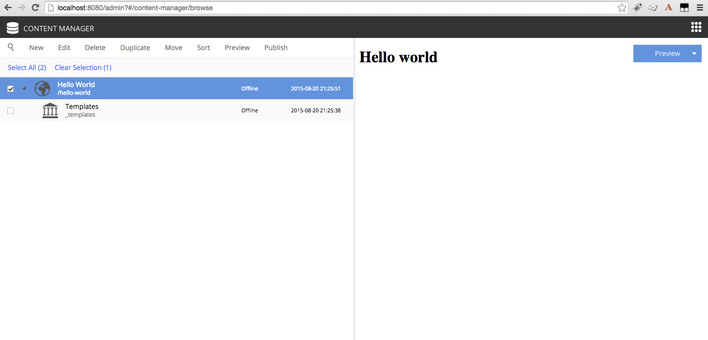

My First App
************
*This guide will lead you through the required steps to build the  "Hello World" app for Enonic XP*

.. WARNING:: WORK IN PROGRESS

.. NOTE:: To complete this tutorial, you will need
  **a local running installation of Enonic XP** and a **text editor of your choice (e.g. Atom)**

  All terminal actions assume you're using OSX or Linux

.. contents:: Table of Contents
  :depth: 1
  :local:

Initialize project
==================

In order to get started quickly, a tool exists to create the basic project structure you need.

Init App
--------
Find a suitable location on your filesystem where you want to place the code for your application, and create an empty folder.
e.g. /Users/<username>/project/myapp

Included with Enonic XP is the :ref:`toolbox`.
It includes an option to initialize an application with all the standard structures typically required for an app.

Run the following command while located in your target folder::

  $XP_INSTALL/toolbox/toolbox.sh init-app -n com.company.myapp

.. tip:: Only basic characters (a-z, 0-9 and .) should be used for application names. We recommend following standard Java package naming
  conventions. To see all options available with the init script, Run: ``$XP_INSTALL/toolbox/toolbox.sh help init-app``

The init-app script will create a standard project structure for your app and configure `Gradle build scripts <../developer/modules/basics/building.html>`_.
Investigate the build.gradle file located in your project's root for more details.

Build and Deploy
----------------
Now that we have set up a project, we should test that it builds and deploys successfully.

.. important:: The $XP_HOME environment variable must be set to the path of the home folder of the XP installation.
  For example, ``$ export XP_HOME=/Users/<name>/enonic-xp-6.0.0/home``

Simply execute the following command from the project root directory::

  ./gradlew deploy

If you don't already have gradle installed, the gradle wrapper will download this first.
Next it will build the app and then attempt to deploy it.

The deployment step simply moves the result of the build, (the application jar file) into the ``$XP_HOME/deploy`` directory.
From there, Enonic XP will detect, install and start the application automatically.

Log in to the Administrative console with the Administrative user credentials and navigate to the Applications App.
Check that the application you just deployed is listed and that it has started.

.. tip:: The administration console is located at ``http://localhost:8080``. The default username is “su” and the password is “password”.

Hello World Site
================

Our next goal is to set up a "Hello World" site in the XP administration console,
but first we must add some initial configuration to our project.

Site descriptor
---------------

An application can serve many purposes and building sites is just one of them. The ``site.xml`` file is the descriptor that will let Enonic
XP know that this app can be added to a site. Site-wide configurations can be defined in this file but we will leave the config element
empty for now.

A basic site.xml file is automatically created by the app-init script::

  src/main/resources/site/site.xml

Page Controller
---------------

A `page controller <../developer/modules/page/controller.html>`_ is a JavaScript file that handles requests such as GET and POST. Controllers usually pass dynamic values to an HTML
view file. No values are passed in the example below, but the view file is specified and rendered with the Thymeleaf templating engine.

- Create a folder called ``hello`` inside the ``src/main/resources/site/pages`` directory. Then create the two files specified below inside
  the ``hello`` folder:

``src/main/resources/site/pages/hello/hello.js``

.. literalinclude:: code/page-initial/hello.js
   :language: js

The `view`  below is a simple HTML file. This file will be updated later to handle dynamic content.

``src/main/resources/site/pages/hello/hello.html``

.. literalinclude:: code/page-initial/hello.html
   :language: html

Once these files are in place, redeploy the app::

  ./gradlew deploy

.. tip:: Each page controller must reside in its own folder under the ``site/pages`` directory. The name of the controller JavaScript file
  must be the same as the directory that contains it. The HTML view file can reside anywhere in the project and have any valid file name.
  This allows view files to be shared between components. Just make sure to specify the full path of the view file in the controller when
  the view is not in the same directory.

Create Site
-----------

Log in to the Administrative console using the Administrative user and navigate to the Content Manager App.

#. Click "New" and select "Site" from the list of content types.
#. Fill in the form with Display Name: "Hello World".
#. Select your "MyApp" application in the "Installed Apps" dropdown.
#. In the dropdown on the right side of the page, select the "hello" page.
#. Click the "Save draft" button on the top-left.
#. Now close the site tab to see the content pane.

You should now have a site that looks something like this:

Adding Countries
================

In order to make our "World" slightly more interesting, we need some data
- or more specifically countries.

Country Content Type
--------------------

To add structured data (such as countries), we need so-called `content types <../developer/content-domain/content-types.html>`_.
The content type defines the form (and underlying schema) of items you manage.

Create a folder called "country" inside the "content-types" folder of your project. Then add the following file to this folder::

  src/main/resources/site/content-types/country/country.xml

.. literalinclude:: code/content-types/country1.xml
  :language: xml

.. tip:: Each content type must reside in its own folder under the ``site/content-types`` directory. The name of the content type XML file
   must be the same as the directory that contains it.

Country Part
------------

We also need a way to present a country - because every country wants to be seen.
This time, rather than just making another page controller, we will create a `part`.
`Parts <../developer/modules/part/index.html>`_ are reusable components that can be added to pages with "regions" - more on this below.

Create a folder called "country" inside the "parts" folder in your project. Then add the following files in the "country" folder::

  src/main/resources/site/parts/country/country.js

.. literalinclude:: code/country-part/country1.js
  :language: javascript

The part controller file above handles the GET request and passes the country content data to the view file which is displayed below.

::

  src/main/resources/site/parts/country/country.html

.. literalinclude:: code/country-part/country1.html
  :language: html

Hello Region Page
-----------------

To wrap things up, let's create a new page component with a single region called "Main".
We will later place the "Country" part into this region.

The benefit of regions is that a page component can be re-used across multiple different pages,
simply by adding different parts to it as needed.

Create a folder called "hello-region" in your project's ``site/pages/`` folder and add the following three files::

  src/main/resources/site/pages/hello-region/hello-region.xml

.. literalinclude:: code/hello-region-page/region1.xml
  :language: xml

The XML file above is a `page descriptor <../developer/modules/page/descriptor.html>`_. Regions and page configurations can be defined here.

::

  src/main/resources/site/pages/hello-region/hello-region.js

.. literalinclude:: code/hello-region-page/region1.js
  :language: javascript

This page controller uses a portal function to get the content and extract the "main" region which was defined in the descriptor XML file.

::

  src/main/resources/site/pages/hello-region/hello-region.html

.. literalinclude:: code/hello-region-page/region1.html
  :language: html

The view file above defines the place on the page where the region will render parts that are dragged and dropped in Live Edit.

When done - redeploy your app once again!

::

  ./gradlew deploy

Add Favorite Country
--------------------

Now that the "Country" content type is installed, we can create new countries using the Content Manager.

#. Select the "Hello World" site from the navigation tree
#. Choose "New" and select "Country" from the list of content types.
#. Fill the form with the details of your favorite country and press save.

TODO IMAGE

Similar to the site, we must also configure a view for the country

#. From the Live Edit panel to the right, select "Hello Region" (this "pretty" name comes from the page xml configuration file).
#. Open the context panel (activated from the configuration gear button in the toolbar).
#. Under the "Insert" tab, drag a "Part" into the box on the page.
#. A new dropdown option will appear. Select the "country" part.
#. Save

You should now have a page that renders your favorite country, something like this:

MISSING IMAGE

Page Templates
==============

With our current solution, sadly, you will have to configure a page for every country you create.
As this is not a very effective way of working with large data sets, we will create a page template to simplify the process.

Create Country Template
-----------------------

1. Select the Templates item located below the "Hello World" site in the content pane.
2. Click "New" and select "Page Template".
3. Fill in the form as follows:

  * Display Name: "Country"
  * Supports: "Country" (selected from the list of content types)

4. In the Live Edit panel on the right, select the "Hello Region" controller.
5. Open the context panel (activated from the gear button in the toolbar).
6. Drag a "Part" into the empty region and select the "country" part.
7. Save

Every "Country" you create will now use this template by default.

.. TIP:: The "Support" property is the key. A page template will support rendering of the content types specified here.

Try this out by creating a few new countries in your site.

Update Favorite Country
------------------------

You might remember that your favorite country was "hardcoded" - so let's change it to use templates as well.

#. Select the country and click "Edit".
#. In Live Edit view, select the entire page (if you select the part first, simply click "parent" twice to select the page).
#. Open the context panel (top right in toolbar), and select "Automatic" from the Page Template selector.
#. Save

You can at any time select another Page template, or even customize the presentation of a single item.

Country List
============

Each country content can now be viewed on a page. But the site home page is still a bit empty. This section will have you alter the "hello"
page controller and view files to list all of the country contents.

Edit the "hello" page controller file ``site/pages/hello/hello.js`` and make the following changes:

.. literalinclude:: code/page-list/hello.js
  :language: javascript

Now edit the "hello" view file ``site/pages/hello/hello.html`` and make the following changes:

.. literalinclude:: code/page-list/hello.html
  :language: html

Redeploy the app from the command line with ``./gradlew deploy``. Each country that you created is now listed on the home page and the names
are also links to the individual content pages.

Hello Geo World
===============

Going back to your site, you will now see a list of the countries we have added.
To make this even more exiting, we will add some geo-location info and configuration capabilities to the site.

Cities
------

Add the following files to your project::

  src/main/resources/site/content-types/city/city.xml

.. literalinclude:: code/content-types/city1.xml
  :language: xml

The file above defines a content type for cities with a required field for the location in latitude and longitude.

::

  src/main/resources/site/parts/city-list/city-list.xml

.. literalinclude:: code/city-part/city-list.xml
  :language: xml

The part descriptor above has a configuration similar to those found in content types.

::

  src/main/resources/site/parts/city-list/city-list.js

.. literalinclude:: code/city-part/city-list.js
  :language: javascript

This controller uses page contributions to put the Google Maps JavaScript into the head of the document.

::

  src/main/resources/site/parts/city-list/city-list.html

.. literalinclude:: code/city-part/city-list.html
  :language: html

Build and deploy your project one final time.

To make use of the changes, do the following:

1. Add the "City List" part to your "Country" page template
  A. Edit the "Country" page template.
  B. Open the context panel by clicking the gear button in the toolbar.
  C. Click and drag a `Part` to the page region below the "Country" part.
  D. Save and close the tab.
2. Create some City contents below a selected country (below are some sample data you may use).
  A. Click a country content that you created earlier.
  B. Click "New" and select "City" from the list of content types. It is important that the city content be created under the country.
  C. Fill in the city name and location. The format must be comma separated latitude and longitude with decimals (for example 37.7833,-122.4167).

Here is a list of cities with latitude and longitude that you may copy/paste from.

+--------------------+----------------+------------------+
|Country             |City            |Lat,Long          |
+====================+================+==================+
|USA                 |San Francisco   |37.7833,-122.4167 |
+                    +----------------+------------------+
|                    |Las Vegas       |36.1215,-115.1739 |
+                    +----------------+------------------+
|                    |Washington D.C. |38.9047,-77.0164  |
+--------------------+----------------+------------------+
|Norway              |Oslo            |59.9500,10.7500   |
+                    +----------------+------------------+
|                    |Bergen          |60.3894,5.3300    |
+                    +----------------+------------------+
|                    |Trondheim       |63.4297,10.3933   |
+--------------------+----------------+------------------+
|Colombia            |Bogota          |4.5981,-74.0758   |
+                    +----------------+------------------+
|                    |Medellin        |6.2308,-75.5906   |
+                    +----------------+------------------+
|                    |Barranquilla    |10.9639,-74.7964  |
+--------------------+----------------+------------------+

When visiting a country page, the browser will now request your location.
You should then see something like this:

MISSING Image (name of country at top, + google map with cities, also present the city which is closest to you using geo-distance sorting)

If you think the location question is bothersome,
we added a simple configuration button to the part (using the city-list.xml file)
- so you can turn this feature on/off. Simply select the part in live edit, open the context panel and toggle on/off.

MISSING Image to turn feature on/off (radiobuttons?)

Go Online
=========

Now, that your "Hello World" is complete, it's time to go live.

#. Select the "Hello World" site in the navigation
#. Click ``Publish`` from the toolbar
#. Remember to check the ``Include children`` checkbox
#. After verifying everything in the Publishing Wizard window - click ``Publish``!

When clicking publish, all the selected items and changes are "cloned" from draft and into the master branch.

You will always see the draft items using the preview function of the Content Manager.
If you have placed your site on root level, you can also see your live site at this url: http://localhost:8080/portal/master/hello-word

Great job - you just created your first App for Enonic XP
- The Enonic team congratulates you - we look forward to see all the brilliant things you will make and are always looking for feedback.

Next steps
==========

IN PROGRESS

This tutorial only covered the basics of app development.

Multiple projects
-----------------

A **best practice** for working on multiple projects would involve keeping a separate XP_HOME folder for each project.
The folder structure for such a set up would look something like this::

  /Users/<name>/development
  /Users/<name>/development/software/<xp-install-version>
  /Users/<name>/development/xp-homes/<project-name>/home
  /Users/<name>/development/projects/<project-name>/<project-source-files>

An actual implementation with projects called my-first-app and company-site would look like this::

  /Users/mla/development/software/enonic-xp-5.3.0
  /Users/mla/development/software/enonic-xp-6.0.0
  /Users/mla/development/xp-homes/my-first-app/home
  /Users/mla/development/xp-homes/company-site/home
  /Users/mla/development/projects/my-first-app/...
  /Users/mla/development/projects/company-site/...

This allows you to have one Enonic XP installation for each version and as many different XP_HOME folders as you need for your projects.
When switching from one project to another, you only have to change the XP_HOME environment variable and then restart the installation of
the Enonic XP version that the project was created for.

Logging JSON objects
--------------------

While developing an app, it can be helpful to see the structure of objects returned by library functions. The best way to do
this is to set up a utilities JavaScript file in the project lib folder. Add the following function to the utilities file:

::

  site/lib/utilities.js

.. code-block:: javascript

  exports.log = function (data) {
    log.info('Utilities log %s', JSON.stringify(data, null, 4));
  };

Call the log function in any controller like the example below and then check the log after refreshing the page.

.. code-block:: javascript

  var util = require('utilities');

  var content = portal.getContent();
  util.log(content);

