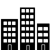

.. _getting-started-my-first-app:

My First App
************
*This guide will lead you through the required steps to build the  "Hello World" app for Enonic XP*

.. NOTE::

  To complete this tutorial, you will need a local running installation
  (see :ref:`getting-started-installation`) of Enonic XP and a text editor of your choice.
  All terminal actions assume you're using OSX or Linux.

.. contents:: Table of Contents
  :depth: 1
  :local:

Initialize project
==================

Enonic XP includes the :ref:`toolbox` which has an option to initialize an application project with the
standard structures required for app development (see :ref:`apps-basics-project`).

Init App
--------
#. Create an empty folder at a suitable location on your filesystem to place the code for your application project. e.g. /Users/<username>/project/myapp

#. Run the following command while located in your target folder:

[$XP_INSTALL]/toolbox/toolbox.sh init-app -n com.company.myapp

.. tip:: Only basic characters (a-z, 0-9 and .) should be used for application names. We recommend following standard Java package naming
  conventions. To see all options available with the init-app script, run: ``[$XP_INSTALL]/toolbox/toolbox.sh help init-app``

The init-app script will create a standard project structure for your app and configure
Gradle build scripts (see :ref:`apps-basics-building`).
Investigate the ``build.gradle`` file located in your project's root for more details.

Build and Deploy
----------------
Now that we have set up a project, we should test that it builds and deploys successfully. But before deploying the app, the $XP_HOME
environment variable must be set to the path of the home folder of the XP installation.

#. Run the following command in the terminal, replacing [$XP_INSTALL] with your installation location (no brackets): ``export XP_HOME=[$XP_INSTALL]/home``

#. Execute the following command from the project root directory: ``./gradlew deploy``

If you don't already have `Gradle <http://gradle.org>`_ installed, the Gradle wrapper will download this first.
Next it will build the app and then attempt to deploy it.

The deployment step simply moves the result of the build (the application jar file) into the ``$XP_HOME/deploy`` directory.
From there, Enonic XP will detect, install and start the application automatically.

1. Check that the app has installed and started

  A. Log in to the Administrative console (http://localhost:8080) with the Administrative user credentials (userid "su" and password
     "password").

  B. Navigate to the Applications App. The application you just deployed should be listed.

  C. Click the app "MyApp" to see information about it and confirm that it has started.

Hello World Site
================

Our next goal is to set up a "Hello World" site in the Content Manager app,
but first we must add some initial configuration to our project.

Site descriptor
---------------

An application can serve many purposes and building sites is just one of them. The ``site.xml`` file is the descriptor that will let Enonic
XP know that this app can be added to a site. Site-wide configurations can be defined in this file but we will leave the config element
empty for now (see :ref:`apps-configure`).

A basic site.xml file was automatically created by the init-app script::

  [project-root]/src/main/resources/site/site.xml

.. note:: All of the files we will be working with are below the "site" directory in the project folder - src/main/resources/site. All file
  paths from now on will begin with "site/".

Page Controller
---------------

A page controller (see :ref:`apps-page-controller`) is a JavaScript file that handles requests such as GET and POST.
Controllers usually pass JavaScript objects with data to be dynamically rendered in an HTML view. No data is passed in the example below,
but the view file is specified and rendered as static HTML.

#. Create a folder called ``hello`` inside the ``site/pages`` directory.

#. Create the page controller and page view files specified below inside the ``hello`` folder:

.. literalinclude:: code/page-initial/hello.js
   :language: js
   :caption: Hello page controller - site/pages/hello/hello.js

The `view`  below is a simple HTML file. This file will be updated later to handle dynamic content.

.. literalinclude:: code/page-initial/hello.html
   :language: html
   :caption: Hello page view - site/pages/hello/hello.html

#. Once these files are in place, redeploy the app:

::

  ./gradlew deploy

.. tip:: Each page controller must reside in its own folder under the ``site/pages`` directory. The name of the controller JavaScript file
  must be the same as the directory that contains it. The HTML view file can reside anywhere in the project and have any valid file name.
  This allows view files to be shared between components.

Create Site
-----------

#. In your browser, navigate to the :ref:`content-content-manager` admin app. (Use the square dots icon in the toolbar to switch between admin apps.)
#. Click "New" and select "Site" from the list of content types. This opens a tab within the page for editing the `site` content.
#. Fill in the form with Display Name: "Hello World".
#. Select your "MyApp" application in the "Applications" dropdown.
#. In the dropdown on the right side of the page, select the "hello" page.
#. Click the "Save draft" button in the toolbar (top-left).
#. Now close the "Hello World" site editor tab to see the content pane.

When you click on the "Hello World" site content, the preview should look something like this:

.. image:: images/hello-world-site1.png

Adding Countries
================

In order to make our "World" slightly more interesting, we need some data
- or more specifically countries.

Country Content Type
--------------------

To add structured data (such as countries), we need so-called :ref:`content-domain-content-types`.
The content type defines the form (and underlying schema) of items you manage.

#. Create a folder called "country" inside the "content-types" folder of your project.

#. Add the Country content type file below to this folder:

.. literalinclude:: code/content-types/country1.xml
  :language: xml
  :caption: Country content type - site/content-types/country/country.xml

Each content type can have a custom icon that will be visible in the Content Manager app. Though not required, content icons can be helpful
for content editors.

#. Copy the image below to the the same folder (content-types/country) with the name `country.png`.

.. image:: images/country.png

This content type defines form inputs for **description** and **population**. All content has a built-in field for **Display Name**. When
the app is redeployed, this content type will produce the form seen below in the Content Manager app.

.. image:: images/country-content-form.png

.. tip:: Each content type must reside in its own folder under the ``site/content-types`` directory. The name of the content type XML file
   must be the same as the directory that contains it.

Country Part
------------

We also need a way to present a country - because every country wants to be seen.
This time, rather than just making another page controller, we will create a :ref:`apps-part`. Parts are reusable components that can be
added to pages with "regions" - more on this below.

#. Create a folder called "country" inside the "parts" folder in your project. Then add the following files in the "country" folder:

.. literalinclude:: code/country-part/country1.js
  :language: javascript
  :caption: Country part controller - site/parts/country/country.js

The part controller file above handles the GET request and passes the country content data to the view file which is displayed below.

.. literalinclude:: code/country-part/country1.html
  :language: html
  :caption: Country part view - site/parts/country/country.html

Hello Region Page
-----------------

Component parts must be placed into a `region` on a page or layout. Let's create a new page component with a single region called "Main".
We will later place the "Country" part into this region.

The benefit of a region (see :ref:`apps-page-region`) is that a page component can be re-used across multiple different pages by simply
adding different parts to it as needed.

#. Create a folder called "hello-region" in your project's ``site/pages/`` folder and add the following three files:

.. literalinclude:: code/hello-region-page/region1.xml
  :language: xml
  :caption: Page descriptor - site/pages/hello-region/hello-region.xml

The XML file above is a :ref:`apps-page-descriptor`. Regions and page configurations can be defined here.

.. literalinclude:: code/hello-region-page/region1.js
  :language: javascript
  :caption: Page controller - site/pages/hello-region/hello-region.js

This page controller uses a portal library (see :ref:`libs-portal`) to get the content and extract
the "main" region which was defined in the descriptor XML file.

.. literalinclude:: code/hello-region-page/region1.html
  :language: html
  :caption: Page view - site/pages/hello-region/hello-region.html

The view file above defines the place on the page where the region will render parts that are dragged and dropped in Live Edit.

#. When done - redeploy your app once again!

::

  ./gradlew deploy

Add Favorite Country
--------------------

Now that the "Country" content type is installed, we can create new countries using the
:ref:`content-content-manager`.

#. Select the "Hello World" site from the navigation tree
#. Choose "New" and select "Country" from the list of content types.
#. Fill in the form with the details of your favorite country and click "Save draft".

.. image:: images/country-content-edit.png

Similar to the site, we must also configure a view for the country

#. From the Live Edit panel to the right, select "Hello Region" (this "pretty" name comes from the page xml configuration file).
#. Open the context panel (activated from the configuration cog button in the toolbar).
#. Under the "Insert" tab, drag and drop a "Part" into the box on the page.
#. A new dropdown option will appear. Select the "country" part. (You can start typing "Country" in the box or you may need to close the
   context panel to see the dropdown.)
#. Save draft and close the content edit tab.

When you click on the country in the content pane, you should see a preview of the rendered page, something like this:

.. image:: images/country-content-rendered.png

Page Templates
==============

With our current solution, sadly, you would have to configure a page for every country you create.
As this is not a very effective way of working with large data sets, we will create a page template to simplify the process.

Create Country Template
-----------------------

1. Select the Templates item located below the "Hello World" site in the content pane.
2. Click "New" and select "Page Template".
3. Fill in the form as follows:

  * Display Name: "Country"
  * Supports: "Country" (selected from the list of content types)

4. In the Live Edit panel on the right, select the "Hello Region" controller.
5. Open the context panel (activated from the cog button in the toolbar).
6. Under the "Insert" tab, drag and drop a "Part" into the empty region.
7. Select the "country" part from the dropdown. (You may need to close the context panel to see the dropdown.)
8. Click "Save draft" in the toolbar and close the tab.

Every "Country" content you create will now use this template by default.

.. TIP:: The "Support" property is the key. A page template will support rendering of the content types specified here.

- Try this out by creating a few new countries in your site. Make sure you click the "Hello World" site before clicking "New" in the
  toolbar. Every content you create will exist as a child of the content that is selected in the content pane.

Update Favorite Country
------------------------

You might remember that your favorite country was "hardcoded" - so let's change it to use templates as well.

#. In the Content pane, select the country and click "Edit".
#. In Live Edit view, click on the page. A box should appear with the name of the country. If the word "country" appears in the box then
   you have selected the part. In that case, click the "Parent" button twice.
#. Open the context panel (cog button in the toolbar) and select "Automatic" from under the "Renderer" label. (It's under the "Inspect" tab)
#. Save draft and close the tab.

You can select another `Page template` at any time, or even customize the presentation of a single content.

Country List
============

Each country content can now be viewed on a page. But the site home page is still a bit empty. This section will have you alter the "hello"
page controller and view files to list all of the country contents.

1. Edit the "hello" page controller file ``site/pages/hello/hello.js`` and make the following changes:

.. literalinclude:: code/page-list/hello.js
  :language: javascript

2. Now edit the "hello" view file ``site/pages/hello/hello.html`` and make the following changes:

.. literalinclude:: code/page-list/hello.html
  :language: html

3. Redeploy the app from the command line with ``./gradlew deploy``.

Each country that you created is now listed on the home page and the names are also links to the individual content pages.

Hello Geo World
===============

Going back to your site, you will now see a list of the countries we have added. To make this even more exiting, we will add a City content
type with geo-location and a `City list` part with configuration capabilities.

Cities
------

The next steps will create a content type for adding cities with location coordinates.

1. Create a folder called `cities` inside the project's ``site/content-types`` folder.

2. Add the content type file below to your project:

.. literalinclude:: code/content-types/city1.xml
  :language: xml
  :caption: City content type - site/content-types/city/city.xml

The file above defines a `content type` for cities with a required field for the location in latitude and longitude.

3. Copy the image below and save it in the same folder with the City content type. Name it "city.png".

We need a `part component` to display the city data. It will list the cities and show a Google map of each location.

1. Create a folder called `city-list` inside the project's ``site/parts`` folder.

2. Add the part descriptor file.

.. literalinclude:: code/city-part/city-list.xml
  :language: xml
  :caption: City list part descriptor - site/parts/city-list/city-list.xml

The part descriptor above has a configuration similar to those found in content types.

3. Add the part controller file.

.. literalinclude:: code/city-part/city-list.js
  :language: javascript
  :caption: City list part controller - site/parts/city-list/city-list.js

This controller uses :ref:`apps-controller-contributions` to put the Google Maps JavaScript into the head of the document.

4. Add the part view file.

.. literalinclude:: code/city-part/city-list.html
  :language: html
  :caption: City list part view - site/parts/city-list/city-list.html

5. Build and deploy your project one final time with ``./gradlew deploy``.

All of the project's files are now complete. The rest of the steps will be performed in the Content Manager app. Now let's make use of the
new city content type and part component.

1. In the Content Manager app, add the "City list" part to your "Country" page template

  A. Edit the "Country" page template.
  B. Open the context panel by clicking the cog button in the toolbar.
  C. Click and drag a `Part` to the page region below the "country" part. (This may be a bit tricky because the "country" part is small.)
  D. Select the "City list" part from the dropdown in the box. You may need to close the context panel to see it.
  E. Save and close the tab.

2. Create a City content below a selected country. (Sample data is available in the table below.)

  A. From the content pane, click a country content that you created earlier.
  B. Click "New" and select "City" from the list of content types. It is important that the city content be created under the country.
  C. Fill in the city name and location. The population is optional. (The location format must be comma separated latitude and longitude
     with decimals. Do not select a page template from the dropdown on the right.)
  D. Save draft.
  E. Create several more city contents below each country content by repeating the previous steps. Sample data is provided in the table below.

+--------------------+----------------+------------------+-----------+
|Country             |City            |Lat,Long          |Population |
+====================+================+==================+===========+
|USA                 |San Francisco   |37.7833,-122.4167 |837,442    |
+                    +----------------+------------------+-----------+
|                    |Las Vegas       |36.1215,-115.1739 |603,488    |
+                    +----------------+------------------+-----------+
|                    |Washington D.C. |38.9047,-77.0164  |658,893    |
+--------------------+----------------+------------------+-----------+
|Norway              |Oslo            |59.9500,10.7500   |618,683    |
+                    +----------------+------------------+-----------+
|                    |Bergen          |60.3894,5.3300    |265,857    |
+                    +----------------+------------------+-----------+
|                    |Trondheim       |63.4297,10.3933   |178,021    |
+--------------------+----------------+------------------+-----------+
|Colombia            |Bogota          |4.5981,-74.0758   |7,000,000  |
+                    +----------------+------------------+-----------+
|                    |Medellin        |6.2308,-75.5906   |2,440,000  |
+                    +----------------+------------------+-----------+
|                    |Barranquilla    |10.9639,-74.7964  |1,885,500  |
+--------------------+----------------+------------------+-----------+

Each country page will now have a list of the cities you created with a Google map of the location.
It should look something like this:

.. image:: images/city-list.png

The `City list` part descriptor (site/parts/city-list/city-list.xml) has configuration inputs for the map type and zoom level. You can set
the default values for these inputs by editing the `City list` part in the `Country` page template.

#. Open the `Country` page template for editing.
#. Open the context panel by clicking the cog button in the toolbar.
#. Click on the `City list` part in the Live Edit panel. (The `Inspect` tab should open.)
#. Set the Map type to "Hybrid" and Zoom level to 12 with the form inputs in the context panel.
#. Save draft and close the edit tab.

Now all of the countries will show the city maps with the new settings. You can override these defaults for any individual country by
editing the Country content and changing its `City list` part configuration.

.. image:: images/city-list-config.png

Go Online
=========

Now that your "Hello World" is complete, it's time to go live.

#. Select the "Hello World" site in the content pane
#. Click "Publish" in the toolbar
#. Remember to check the "Include children" checkbox
#. After verifying everything in the Publishing Wizard window - click "Publish"!

When clicking publish, all the selected items and changes are "cloned" from draft and into the master branch (:ref:`node-domain-repository`).

You will always see the draft version of content in the preview window and with the preview function of the :ref:`content-content-manager`.
If you have placed your site on root level, you can also see your live site at this url:
``http://localhost:8080/admin/portal/preview/master/hello-world``.

Great job - you just created your first App for Enonic XP - The Enonic team congratulates you - we look forward to seeing all the brilliant
things you will make and are always looking for feedback.

Next steps
==========

This tutorial only covered the basics of app development. Explore the documentation and check out examples of more advanced apps on
`GitHub <https://github.com/enonic>`_. The `Xeon <https://github.com/enonic/app-xeon-onepager>`_ app is fairly simple but still much more
advanced than this. Be sure to view the 6.0 branch. The `Superhero <https://github.com/enonic/app-superhero-blog>`_ app is more complicated
but still a work in progress (use the new6 branch).

Multiple projects
-----------------

A **best practice** for working on multiple projects would involve keeping a separate XP_HOME folder for each project.
The folder structure for such a set up would look something like this::

  /Users/<name>/development
  /Users/<name>/development/software/<xp-install-version>
  /Users/<name>/development/xp-homes/<project-name>/home
  /Users/<name>/development/projects/<project-name>/<project-source-files>

An actual implementation with projects called my-first-app and company-site would look like this::

  /Users/mla/development/software/enonic-xp-5.3.0
  /Users/mla/development/software/enonic-xp-6.0.0
  /Users/mla/development/xp-homes/my-first-app/home
  /Users/mla/development/xp-homes/company-site/home
  /Users/mla/development/projects/my-first-app/...
  /Users/mla/development/projects/company-site/...

This allows you to have one Enonic XP installation for each version and as many different XP_HOME folders as you need for your projects.
When switching from one project to another, you only have to change the XP_HOME environment variable and then restart the installation of
the Enonic XP version that the project was created for.

Logging JSON objects
--------------------

While developing an app, it can be helpful to see the structure of objects returned by library functions. The best way to do
this is to set up a utilities JavaScript file in the project lib folder. Add the following function to the utilities file:

::

  site/lib/utilities.js

.. code-block:: javascript

  exports.log = function (data) {
    log.info('Utilities log %s', JSON.stringify(data, null, 4));
  };

Call the log function in any controller like the example below and then check the log after refreshing the page.

.. code-block:: javascript

  var util = require('utilities');

  var content = portal.getContent();
  util.log(content);

Gradle watch
------------

It can be quite time consuming to frequently switch to the terminal to redeploy an app during development. Try using ``./gradlew watch``
in the terminal (from the project root) to **automatically redeploy** your app every time a change to a file is detected. The $XP_HOME
environment variable must be set in the terminal window.