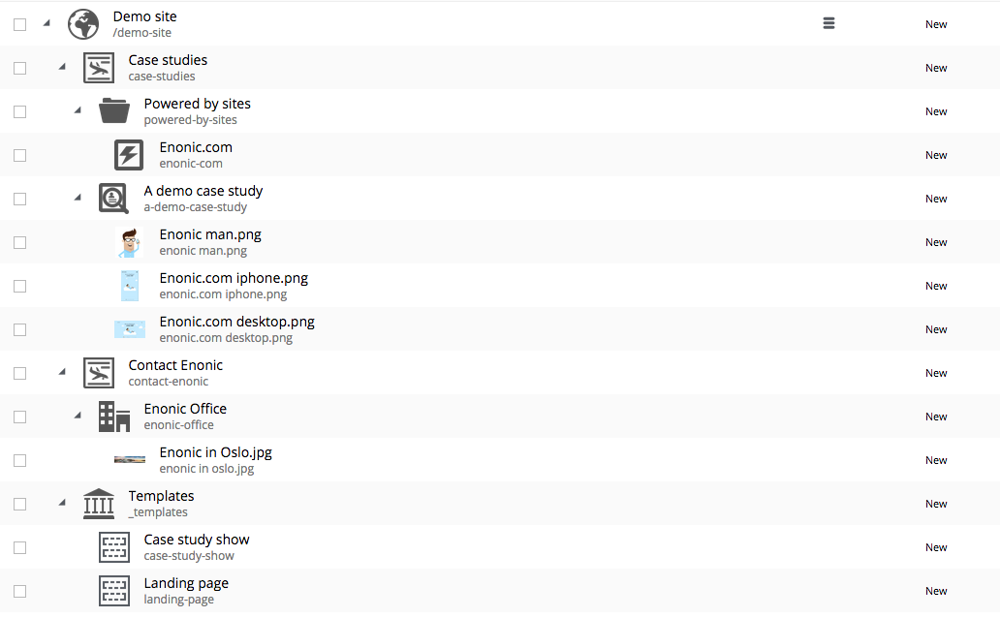
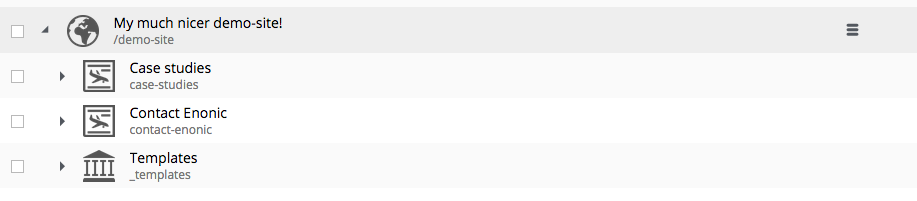

.. _operations-export:

Export and Import
=================

Exporting and importing data in your Enonic XP installation is useful both for securing data and migrating between installations.
Enonic XP ships with a set of tools (:ref:`toolbox`) to ease the operation of exporting and importing data from the system.

.. CAUTION::

  At the moment, exporting and importing data can only be done to and from files on the
  same server running Enonic XP.

Content Export/Import vs System Dump/Load
-----------------------------------------

Both enable you to export your data to a serialized format and import the serialized data into another instance.
But, while the export/import focuses on a given content, the dump/load is used to export an entire system (all repositories and branches).
This is used, for example to migrate between systems or perform upgrade scripts.
Dump and Load also supports dumping complete version history and branches.

Content Export
--------------

The export operation will extract data for a given content URL and store it as XML
in a sub-folder under ``$XP_HOME/data/export``.
The REST service for export is found at the following URL::

  http://<host>:<port>/api/repo/export

The export REST service accepts a JSON in this format:

.. code-block:: json

  {
    "sourceRepoPath": "<source-repo-path>",
    "exportName": "<name>",
    "exportWithIds": <true|false>,
    "dryRun": <true|false>
  }

To ease the process, we have provided an :ref:`toolbox-export` tool.

Content Import
--------------

The import will take data from a given export directory and load it into Enonic XP at the
desired content path. The REST service for import is found at the following URL::

  http://<host>:<port>/api/repo/import

The import REST service accepts a JSON in this format:

.. code-block:: json

  {
    "exportName": "<name>",
    "targetRepoPath": "<target-repo-path>",
    "importWithIds": <true|false>,
    "importWithPermissions": <true|false>,
    "dryRun": <true|false>
    "xslSource": "<xsl-file-path>"
    "xslParams": {
      "<name>": "<value>"
    }
  }

To ease the process, we have provided an :ref:`toolbox-import` tool.

Content Export data structure
-----------------------------

Let's look at how this works. The following structure will be exported:

Run the export command::

  $ ./toolbox.sh export -a su:password -s cms-repo:draft:/ -t myExport

Below is the resulting structure in the export folder ``$XP_HOME/data/export/myExport``::

  ./content
  ./content/_
  ./content/_/node.xml
  ./content/demo-site
  ./content/demo-site/_
  ./content/demo-site/_/manualChildOrder.txt
  ./content/demo-site/_/node.xml
  ./content/demo-site/_templates
  ...
  ./content/demo-site/case-studies
  ./content/demo-site/case-studies/_
  ./content/demo-site/case-studies/_/node.xml
  ./content/demo-site/case-studies/a-demo-case-study
  ...
  ./content/demo-site/case-studies/a-demo-case-study/enonic man.png
  ./content/demo-site/case-studies/a-demo-case-study/enonic man.png/_
  ./content/demo-site/case-studies/a-demo-case-study/enonic man.png/_/bin
  ./content/demo-site/case-studies/a-demo-case-study/enonic man.png/_/bin/Enonic man.png
  ...
  ./content/demo-site/case-studies/powered-by-sites
  ...
  ./content/demo-site/contact-enonic
  ...

``content``
  The base folder of the export. All content in ``cms-repo``
  has this as root path.

``content/_``
  All folders named ``_`` are system folders for the data at the
  current level.

``content/_/node.xml``
  The definition of the node, e.g. all data for the current node

``content/demo-site``
  This is the site from the screenshot above.

``content/demo-site/_/manualChildOrder.txt``
  Our demo-site has manually ordered children, this file contains an
  ordered list of children.

``content/demo-site/case-studies``
  This 'case-studies' content is the first element in the site.

``content/demo-site/case-studies/a-demo-case-study/enonic man.png/_/bin``
  The ``A demo case study`` content has a binary attachment called
  ``Enonic man.png``. The folder ``_/bin`` contains the actual binary files.

Changing export data
--------------------

It is possible to make manual changes to the exported data before importing.

Using the above export as an example, the ``demo-site`` displayName can be changed to something more suitable::

  myExport $ vi content/demo-site/_/node.xml

  <?xml version="1.0" encoding="UTF-8" standalone="yes"?>
  <node xmlns="urn:enonic:xp:export:1.0">
    <id>2dfbdc41-af98-4b3c-a2a9-9dc4814d003a</id>
    <childOrder>_manualordervalue DESC</childOrder>
    <nodeType>content</nodeType>
    <data>
      <boolean name="valid">true</boolean>
      <string name="displayName">My much nicer demo-site!</string>
      <string name="type">portal:site</string>
      <string name="owner">user:system:su</string>

After some data has been changed, it can be imported again::

  $ ./toolbox.sh import -a su:password -s myExport -t cms-repo:draft:/

.. CAUTION::

  Editing exported data is experimental at the moment and will potentially cause trouble if not
  done carefully. For exports without ids, references will be broken and must be fixed manually. When
  importing *with* ids onto existing data, renaming and changing manual order will not yet
  work as expected.

System Dump
-----------

The dump operation will extract data from your entire system and store it as XML in a sub-folder under ``$XP_HOME/data/dump``.
The REST service for export is found at the following URL::

  http://<host>:<port>/api/system/dump

The dump REST service accepts a JSON in this format:

.. code-block:: json

  {
    "name": "<dump-name>"
  }

To ease the process, we have provided a :ref:`toolbox-dump` tool.

System Load
-----------

The load operation will take data from a given dump directory and load it into Enonic XP.
The REST service for load is found at the following URL::

  http://<host>:<port>/api/system/load

The export REST service accepts a JSON in this format:

.. code-block:: json

  {
    "name": "<dump-name>"
  }

To ease the process, we have provided a :ref:`toolbox-load` tool.
