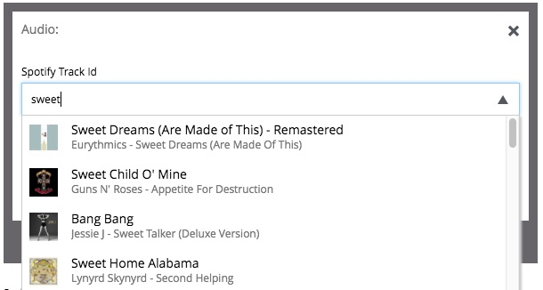

.. _custom-selector_tutorial:

Build a Custom Selector
=======================

*This guide will lead you through the required steps to build an input of type Custom Selector.*

* :ref:`Create a content type<custom-selector-content-type>`


* :ref:`Create a service<custom-selector-service>`

* :ref:`Response format<custom-selector-service-json>`

* :ref:`Sample service<custom-selector-service-sample>`

* :ref:`Integration with Spotify API<custom-selector-sample-spotify>`

.. _custom-selector-content-type:
.. rubric:: Create a content type

* Create a folder called “my-custom-selector” inside the “site/content-types” folder of your project.
* In that folder create a configuration schema for the "my-custom-selector" content type.

.. literalinclude:: code/my-custom-selector.xml
    :language: xml

.. _custom-selector-service:
.. rubric:: Create a service (or refer to a service in another app)

* Create a folder called “my-custom-selector-service” (folder name must match the one specified in the config schema) inside the “resources/services” folder of your project.
* In that folder create a javascript service file called “my-custom-selector-service.js” (again, the name must match the config schema).
* Create GET handler method in this service file and make sure it returns JSON in the proper format.

.. tip:: You can also refer to service file in another application (for example, *com.myapplication.app:myservice*) instead of adding one to your application.

.. literalinclude:: code/my-custom-selector-ext-service.xml
    :language: xml

.. _custom-selector-service-json:
.. rubric:: Response format

Format of JSON response from the service:

    id
      Unique Id of the option

    displayName
      Option title

    description (optional)
      Detailed description

    iconUrl (optional)
      Path to the thumbnail image file

    icon (optional)
      Inline image content (for example, SVG)

.. _custom-selector-service-sample:
.. rubric:: Example of a simple service file

Below is a simple service file that returns two items in the result set, one with external thumbnail image, and another one with inline SVG markup:

.. literalinclude:: code/my-custom-selector-service.js
    :language: javascript

.. _custom-selector-sample-spotify:
.. rubric:: Integration with Spotify API

And here's a bit more advanced version of the service file that fetches song names from the Spotify API:

.. literalinclude:: code/spotify-service.js
    :language: javascript

