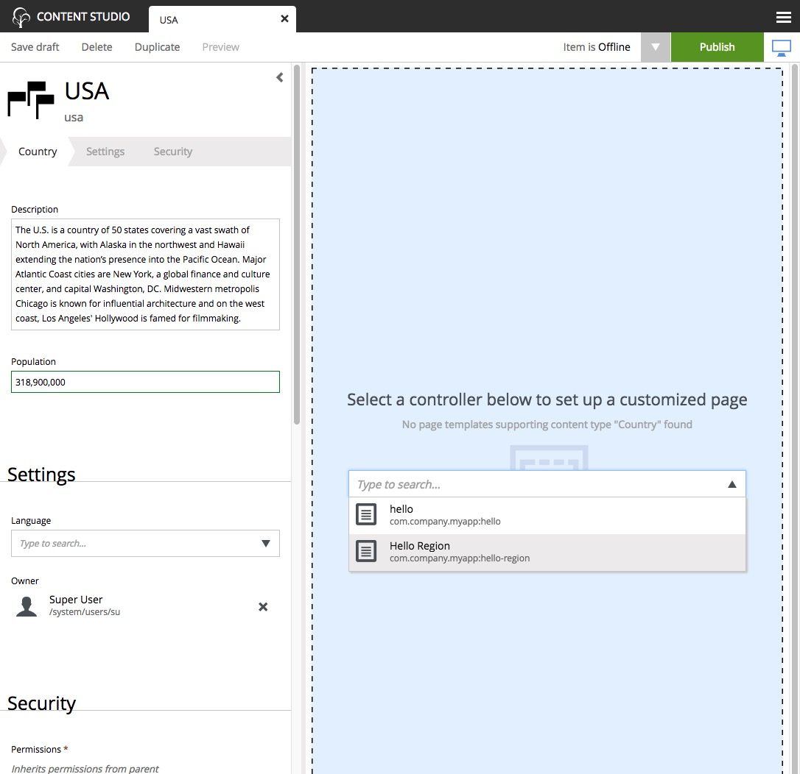
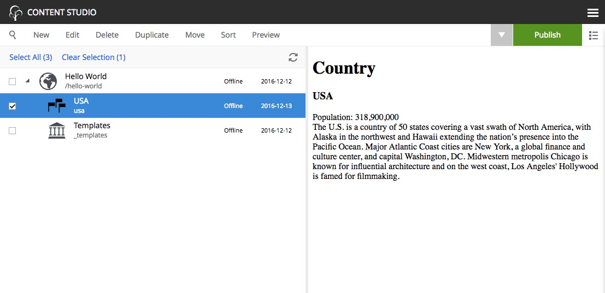

Add your favorite country
=========================

.. |cogicon| image:: images/icon-cog.png
.. |monitoricon| image:: images/icon-monitor.png
.. |particon| image:: images/icon-part.png

Now that the "Country" content type is installed (and we have a part to display them), we can create
new countries using the Content Studio interface.

1. Right-click on the "Hello World" site from the navigation tree and select "New". The "Create Content" dialogue will open.
2. Click "Country" from the list of content types.
3. Fill in the form with the details of your favorite country.

Similar to the site, we must also configure a view for the country

4. In the toolbar, in the top right corner of the page, click the button with the monitor icon |monitoricon| to activate the Page Editor
   (blue background).

5. In the Page Editor, select "Hello Region" from the template selector dropdown. If the dropdown arrow is not visible, double-click
   inside the option field or start typing "hello world" in it to see the options.

The blue box with "Drop here" is the region that we defined in the project code and it's where we add components here in the page editor.

6. Click the cog button |cogicon| in the toolbar to open the Inspection Panel (far right).
#. In the Inspection Panel, click the "Insert" tab. This reveals a list of default component types that can be placed into regions.
#. Click and drag the "Part" |particon| into the box on the page.
#. A new dropdown option will appear. Select the "country" part.
#. Save draft and close the content edit tab.

When you click on the country in the content pane, you should see a preview of the rendered page, something like this:

