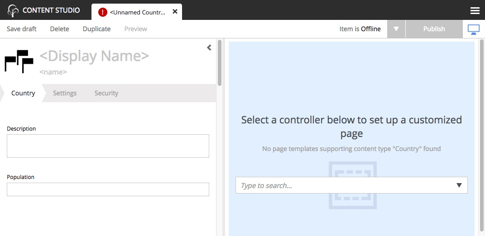

Add some Countries
==================

In order to make our "World" slightly more interesting, we will add some countries as structured data.

The structure of data (such as countries) are defined in XML files and are referred to as :ref:`content_types`.
The content type defines the form (and underlying schema) of items you manage.

1. Create a folder named "country" inside the "content-types" folder of your project.

2. Create an XML file named "country.xml" in the "country" folder and paste in the code below for the Country content type.

.. literalinclude:: code/content-types/country1.xml
  :language: xml
  :caption: Country content type - site/content-types/country/country.xml

Each content type can have a custom icon that will be visible in the Content Studio interface. Though not required, content icons can be
helpful for content editors.

3. Copy the image below to the the same folder (content-types/country) with the name `country.png`.

.. image:: images/country.png

This content type defines form inputs for **description** and **population**. Every content has a built-in field for **Display Name**. When
the app is redeployed, you can create a new content of type "Country" in the Content Studio. The Country content type will produce the form
seen below. Each country content that is created with this form will become a page in the site when a page component is added to it with the
dropdown in the page editor on the right. More on this later.

.. tip:: Each content type must reside in its own folder under the ``site/content-types`` directory. The name of the content type XML file
   and the icon PNG file must be the same as the directory that contains them.

