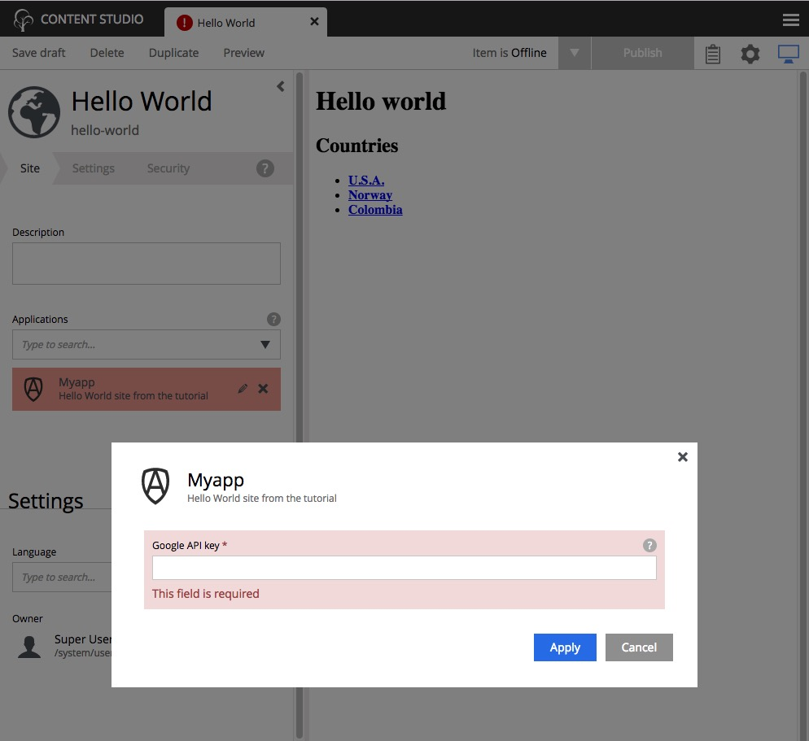

App configuration
=================

Google Maps won't work without an API key. We need somewhere to enter the key so that it can be accessed by any component that needs it. The
perfect place to define a site-wide configuration is in the site descriptor.

1. Replace the contents of the site.xml file at ``site/site.xml`` with the code below.

.. literalinclude:: code/site-config/site.xml
  :language: xml
  :caption: Site descriptor - site/site.xml

The inputs defined in the site descriptor will appear in a form when editing the site content in the Content Studio.

2. If you didn't start XP in :ref:`gradle_dev_mode` then build and deploy your project one final time with ``./gradlew deploy``.

All of the project's files are now complete. The rest of the steps will be performed in the Content Studio interface.

3. Edit the site content. You will notice that the "Myapp" application is now red due to a missing required configuration.

#. Click the pencil icon to edit the Myapp configuration and enter your Google API key. You can get a Google API key from the
   `Google developers <https://developers.google.com/maps/documentation/javascript/get-api-key>`_ site if you don't already have one.

