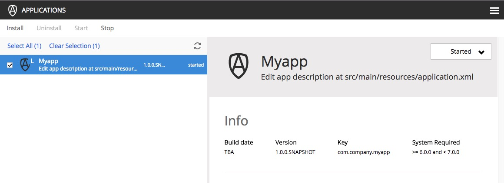

.. _building:

Build and Deploy
----------------

Now that the basic project structure is set up, we should test that it builds and deploys successfully. But before deploying the app, the
``$XP_HOME`` environment variable must be set to the path of the home folder of the XP installation.

1. Run the following command in the terminal, replacing [$XP_INSTALL] with your installation location (no brackets):

Linux and OSX::

  export XP_HOME=[$XP_INSTALL]/home

For example, if your XP installation is at ``/Users/enonic/installs/enonic-xp-6.9.0`` then you would enter:

::

  export XP_HOME=/Users/enonic/installs/enonic-xp-6.9.0/home

Windows::

  set XP_HOME=[$XP_INSTALL]/home

2. Execute the following command (from the project root directory):

Linux and OSX::

  ./gradlew deploy

Windows::

  gradlew deploy

The included `Gradle <http://gradle.org>`_ wrapper will build the app and then attempt to deploy it to your installation.

The deployment step simply moves the result of the build (the application JAR file) into the ``$XP_HOME/deploy`` directory.
From there, Enonic XP will detect, install and start the application automatically.

You will need to access the Administrative console to check that the app has installed and started. Enonic XP must be running to proceed.

3. Log in to the Administrative console (http://localhost:8080) with the Administrative user credentials. (The default credentials are
userid: **su** and password: **password**).

4. Navigate to the Applications Tool. The application you just deployed should be listed here.

5. Click the app called "Myapp" to see information about it and confirm that it has started.

.. NOTE::

  You can change the display name of the application by editing the gradle.properties file.
