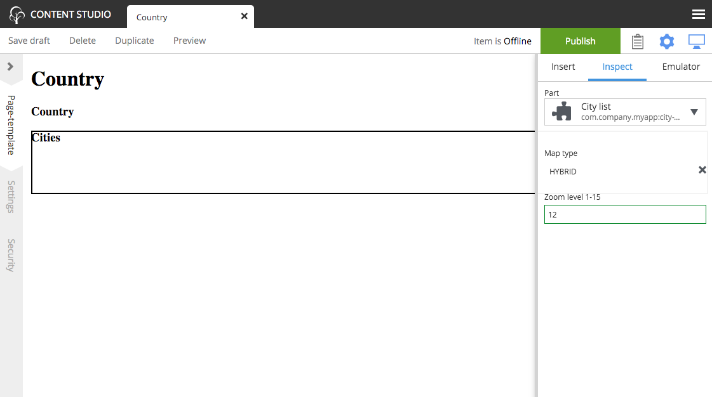

Configure City List
===================

.. |cogicon| image:: images/icon-cog.png

The `City list` part descriptor (site/parts/city-list/city-list.xml) has configuration inputs for the map type and zoom level. You can set
the default values for these inputs by editing the `City list` part in the `Country` page template.

#. Open the `Country` page template for editing.
#. Open the Inspection Panel by clicking the cog button |cogicon| in the toolbar.
#. Click on the `City list` part in the Page Editor panel. (The `Inspect` tab should open.)
#. Set the Map type to "Hybrid" and Zoom level to 12 with the form inputs in the context panel.
#. Save draft and close the edit tab.

Now all of the countries will show the city maps with the new settings. You can override these defaults for any individual country by
editing the Country content and changing its `City list` part configuration.

