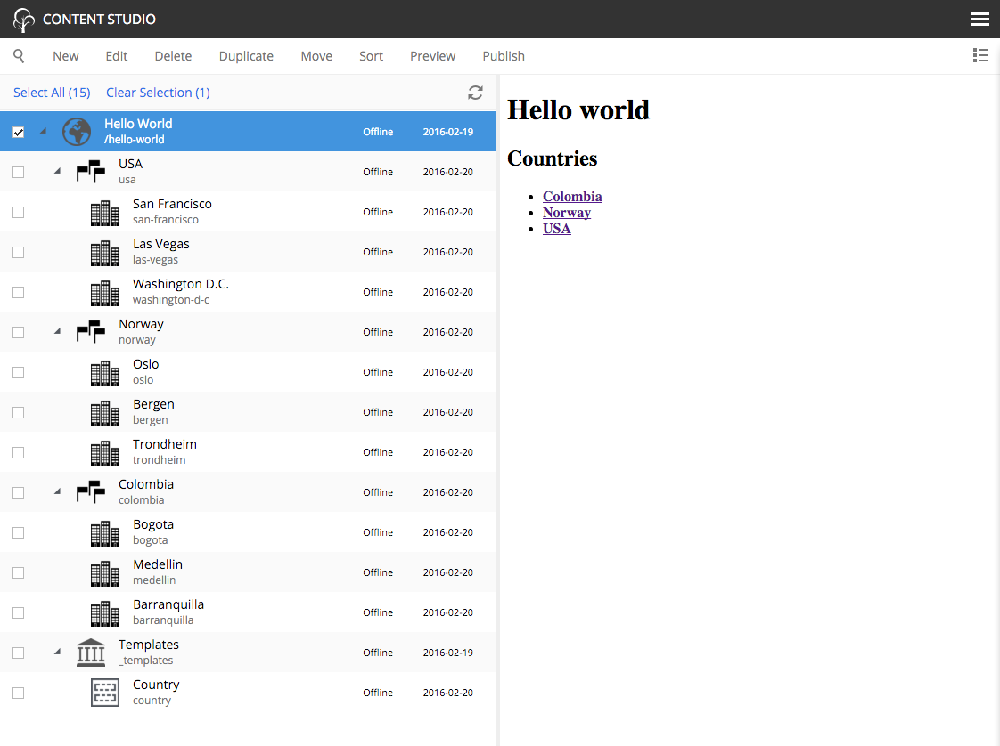
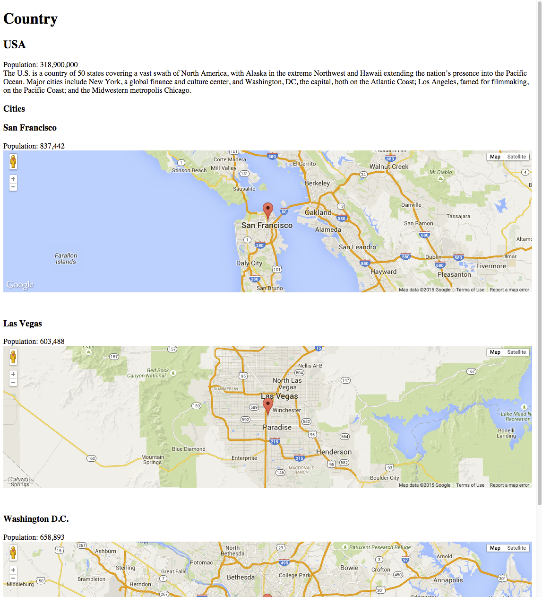

.. _my_first_app:

My First App
============
*This guide will lead you through the required steps to build the "Hello World" app for Enonic XP.*

This three-part tutorial will cover the basics of creating a website application for Enonic XP. You will learn how to initialize new
application projects and deploy them. We will create a simple website that displays a list of countries and cities with a Google map of each
city. Upon completion, you will be familiar with content types, page and part components, page templates, regions, and the Content Studio
app. You won't be writing any code - just copy/paste from the examples.

The screen-shots below show the final product of this tutorial.

.. NOTE::

  To complete this tutorial, you will need a local running installation
  (see :ref:`local_installation`) of Enonic XP and a text editor of your choice.
  All terminal actions assume you're using OSX or Linux.

.. toctree::
  :maxdepth: 1

  part-1
  part-2
  part-3

The screenshot below shows the Content Studio interface with content on the left and a site preview on the right.

The image below is what a page of the site will look like when finished.

