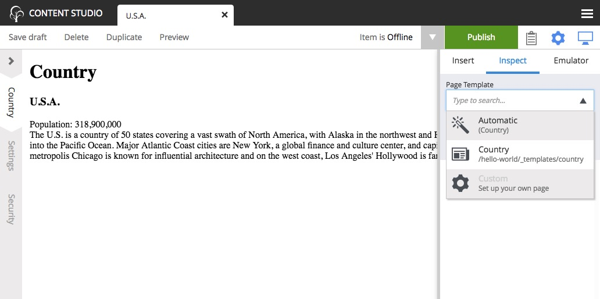

The Country Page Template
=========================

With our current solution, sadly, we would have to create a new page for every country we add.
As this is not a very effective way of working with large data sets, we will create a page template that will automatically render all
country content.

#. Select the Templates item |templatesicon| located below the "Hello World" site in the content pane.
#. Click "New" and select "Page Template".
#. Fill in the form as follows:

  * Display Name: "Country"
  * Supports: "Country" (selected from the list of content types)

4. If the blue Page Editor panel is not displayed on the right, click the |monitoricon| button in the toolbar.
#. Select the "Hello Region" controller with the dropdown in the blue Page Editor panel.
#. Open the Inspection Panel (activated from the cog button |cogicon| in the toolbar).
#. Under the "Insert" tab, drag and drop a "Part" |particon| into the empty region where it says "Drop here".
#. Select the "country" part from the dropdown.
#. Click "Save draft" in the toolbar and close the tab.

Every "Country" content you create will now use this template by default.

.. TIP:: The "Support" property is the key. A page template will support rendering of the content types specified here.

Try this out by creating a few new countries in your site. Be aware that every content you create will be a child of the content that was
selected in the content pane, so make sure you select the "Hello World" site before clicking "New" in the toolbar. Or better yet, get in the
habit of right-clicking the desired parent content and selecting "New" from the context menu. This way you will never accidentally create a
content in the wrong place.

Extra task
----------

**Make your Favorite Country use the page template too!**

You might remember that your favorite country was "hardcoded" - so let's change it to use templates as well.

#. In the Content pane, double click the country content to edit it.
#. Open the Inspection Panel |cogicon| and select the "Inspect" tab if it's not already selected.
#. You should see a label for "Page Template" with "Custom" selected and a label for "Page controller" with "Hello Region" selected. If you
   see a label for "Part" instead then click on the page above the country name to select the page. Then click the "Inspect" tab. (See image
   below)
#. Now select "Automatic" from under the "Page Template" label in the "Inspect" tab.
#. Save draft and close the tab.

You can select another `Page template` at any time, or even customize the presentation of a single content.
